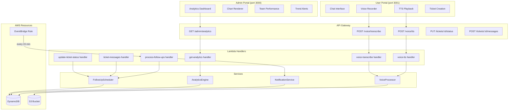

# Design Document: Advanced Features

## Overview

This design covers three feature areas for the NovaSupport system: Follow-up Automation, Voice Integration, and Analytics Dashboard. All features build on the existing AWS infrastructure (Lambda, DynamoDB, API Gateway, S3, SQS) and the existing service layer (`follow-up-scheduler.ts`, `voice-processor.ts`, `analytics-engine.ts`).

The primary work involves:
1. Wiring the existing `follow-up-scheduler.ts` into ticket lifecycle events (status changes, user messages) via new Lambda handlers
2. Creating API endpoints for voice transcription/TTS and integrating voice recording into the User Portal chat and ticket creation flows
3. Enhancing the Admin Portal analytics view with team performance tables, trend visualization, and richer chart rendering

## Architecture



## Components and Interfaces

### 1. Follow-Up Automation Components

#### 1.1 Modified Handler: `update-ticket-status.ts`

The existing status update handler will be extended to trigger follow-up scheduling when a ticket transitions to `pending_user` or `resolved`.

```typescript
// After successful status update:
if (newStatus === 'pending_user') {
  await scheduleFollowUp(ticket);
}
if (newStatus === 'resolved') {
  await scheduleSatisfactionSurvey(ticket);
}
```

#### 1.2 Modified Handler: `ticket-messages.ts`

The existing message handler will be extended to cancel pending follow-ups when a user sends a message.

```typescript
// After successful message creation:
await cancelPendingFollowUps(ticketId);
```

#### 1.3 New Handler: `process-follow-ups.ts`

A new Lambda handler invoked on a schedule (EventBridge rule, every 15 minutes) that:
1. Scans for Follow_Up_Records with status "pending" and scheduledAt <= now
2. Sends each due follow-up via the NotificationService
3. Updates the record status to "sent"

```typescript
interface ProcessFollowUpsResult {
  processed: number;
  failed: number;
  errors: Array<{ ticketId: string; error: string }>;
}
```

#### 1.4 Existing Service: `follow-up-scheduler.ts`

Already implemented with `scheduleFollowUp()`, `scheduleSatisfactionSurvey()`, `cancelPendingFollowUps()`, `getPendingFollowUps()`, `generateFollowUpMessage()`, `generateSurveyMessage()`. No changes needed to the service itself.

### 2. Voice Integration Components

#### 2.1 New Handler: `voice-transcribe.ts`

Lambda handler for POST `/voice/transcribe`:

```typescript
// Request body
interface TranscribeRequest {
  s3Key?: string;       // S3 key of uploaded audio
  audioData?: string;   // Base64-encoded audio (for small files)
  format: AudioFormat;  // 'wav' | 'mp3' | 'ogg' | 'webm'
  language?: string;    // ISO 639-1 code, optional
  duration: number;     // seconds
}

// Response
interface TranscribeResponse {
  text: string;
  language: string;
  confidence: number;
  detectedTechnicalTerms: string[];
}
```

#### 2.2 New Handler: `voice-tts.ts`

Lambda handler for POST `/voice/tts`:

```typescript
// Request body
interface TTSRequest {
  text: string;
  language?: string;  // defaults to 'en'
  voice?: string;
  speed?: number;     // 0.5 to 2.0
}

// Response
interface TTSResponse {
  url: string;      // S3 presigned URL for audio playback
  duration: number;  // estimated seconds
  format: string;    // 'mp3'
}
```

#### 2.3 User Portal Voice Integration

Enhance the User Portal with:
- Voice recording in the ticket creation form (already has a basic `handleVoiceRecord` in `portal-app.js` that records to a file; needs to call transcription API and populate the description field)
- TTS playback buttons on ticket detail messages and chat responses

### 3. Analytics Dashboard Components

#### 3.1 Enhanced Handler: `get-analytics.ts`

The existing handler already returns overview stats, performance report, trends, and alerts. It will be enhanced to also return:
- Category distribution data for a pie/bar chart
- Time-series data for trend visualization (tickets per day over the period)

#### 3.2 Enhanced Admin Portal: `app.js` Analytics Section

The existing `loadAnalytics()` function renders basic stats and bar charts. It will be enhanced with:
- Team performance table with sortable columns
- Trend cards with severity indicators and recommended actions
- Top issues ranking
- Category distribution chart

## Data Models

### Follow-Up Records (Existing)

```
PK: FOLLOWUP#<ticketId>
SK: <FOLLOW_UP|SATISFACTION_SURVEY>#<scheduledAt>

Fields:
  ticketId: string
  type: 'FOLLOW_UP' | 'SATISFACTION_SURVEY'
  status: 'pending' | 'sent' | 'cancelled'
  scheduledAt: string (ISO 8601)
  message: string
  createdAt: string (ISO 8601)
  cancelledAt?: string (ISO 8601)
```

### Metric Records (Existing)

```
PK: METRIC#<dateKey>
SK: <resolution|response|satisfaction>#<ticketId>

Fields:
  ticketId: string
  date: string (YYYY-MM-DD)
  metricType: 'resolution' | 'response' | 'satisfaction'
  value: number
  resolvedBy: 'ai' | 'human'
  team?: string
  category?: string

GSI1:
  GSI1PK: TIMESERIES#<metricType>
  GSI1SK: <dateKey>#<ticketId>
```

### Voice Audio Files (S3)

```
Key: voice-recordings/<ticketId>/<timestamp>-<random>.webm  (uploads)
Key: voice-responses/<timestamp>-<random>.mp3                (TTS output)
```

### Analytics Response Shape

```typescript
interface AnalyticsResponse {
  overview: {
    totalTickets: number;
    statusCounts: Record<string, number>;
    priorityCounts: Record<string, number>;
    categoryCounts: Record<string, number>;
  };
  performanceReport: PerformanceReport | null;
  trends: Trend[] | null;
  alerts: Alert[] | null;
  period: 'daily' | 'weekly' | 'monthly';
}
```


## Correctness Properties

*A property is a characteristic or behavior that should hold true across all valid executions of a system — essentially, a formal statement about what the system should do. Properties serve as the bridge between human-readable specifications and machine-verifiable correctness guarantees.*

### Property 1: Follow-up scheduling produces correct records on status change

*For any* valid ticket, when its status changes to "pending_user", scheduling a follow-up SHALL produce a Follow_Up_Record with type FOLLOW_UP, status "pending", scheduledAt approximately 48 hours in the future, and a message containing the ticket ID and subject. Similarly, when status changes to "resolved", scheduling SHALL produce a record with type SATISFACTION_SURVEY, status "pending", and scheduledAt approximately 24 hours in the future.

**Validates: Requirements 1.1, 1.2, 1.3**

### Property 2: Message personalization includes ticket context

*For any* ticket with a non-empty subject and description, the generated follow-up message SHALL contain the ticket ID, the ticket subject, and a description excerpt no longer than 120 characters. The generated survey message SHALL contain the ticket ID and subject.

**Validates: Requirements 2.1, 2.2**

### Property 3: Custom message overrides generated content

*For any* ticket and any non-empty custom message string, scheduling a follow-up with a custom message SHALL produce a Follow_Up_Record whose message field equals the custom message exactly.

**Validates: Requirements 2.3**

### Property 4: Cancellation sets all pending follow-ups to cancelled

*For any* ticket with one or more pending follow-ups, calling cancelPendingFollowUps SHALL set all pending records to status "cancelled" with a non-null cancelledAt timestamp, and return the count of cancelled records.

**Validates: Requirements 3.1**

### Property 5: Voice input validation rejects invalid inputs

*For any* voice input where the format is not in {wav, mp3, ogg, webm}, or the duration exceeds 300 seconds, or the duration is <= 0, or the language is not in the supported languages list, the Voice_Processor SHALL throw a VoiceProcessingError with a descriptive message.

**Validates: Requirements 5.4, 5.5, 7.3**

### Property 6: TTS input validation rejects invalid inputs

*For any* TTS input where the text is empty or whitespace-only, or the language is not supported, or the speed is outside the range [0.5, 2.0], the Voice_Processor SHALL throw a VoiceProcessingError with a descriptive message.

**Validates: Requirements 7.4**

### Property 7: Pronunciation guide replaces technical terms

*For any* text string containing one or more technical terms from the pronunciation guide dictionary, buildPronunciationGuide SHALL replace each occurrence with its phonetic equivalent, and the resulting string SHALL not contain the original abbreviated form of any replaced term.

**Validates: Requirements 6.3**

### Property 8: AI resolution percentage calculation

*For any* non-empty list of resolution metric records where each record has resolvedBy as either "ai" or "human", the AI resolution percentage SHALL equal (count of "ai" records / total records) * 100. For an empty list, the percentage SHALL be 0.

**Validates: Requirements 9.3**

### Property 9: Trend alert generation threshold

*For any* list of Trend objects, generateTrendAlerts SHALL produce an alert for each trend where affectedUsers > 10, and SHALL produce no alerts for trends where affectedUsers <= 10. The number of generated alerts SHALL equal the number of trends with affectedUsers > 10.

**Validates: Requirements 10.2**

### Property 10: Spike detection threshold

*For any* category, current count, and 7-day average where the average is positive, detectSpikes SHALL return true if and only if currentCount >= sevenDayAverage * 1.5. When sevenDayAverage is 0, detectSpikes SHALL return false.

**Validates: Requirements 10.3**

### Property 11: Critical service escalation matching

*For any* alert and list of critical service names, escalateCriticalAlert SHALL return non-null escalation info if and only if the alert description (case-insensitive) contains at least one of the critical service names. The returned escalation SHALL reference the matched service name.

**Validates: Requirements 10.4**

### Property 12: Performance report team aggregation correctness

*For any* set of resolution, response, and satisfaction metric records with team fields, getPerformanceReport SHALL produce a teamPerformance array where each team's averageResolutionTime equals the sum of resolution values for that team divided by the team's ticket count, and each team's aiResolvedPercentage equals (AI-resolved count / total count) * 100 for that team.

**Validates: Requirements 9.1, 11.2**

### Property 13: Time range period calculation

*For any* reference date, getTimeRangeForPeriod("daily") SHALL return a range spanning exactly 1 day, "weekly" SHALL span exactly 7 days, and "monthly" SHALL span exactly 30 days, all ending at the reference date.

**Validates: Requirements 12.1**

## Error Handling

### Follow-Up Automation
- If DynamoDB write fails during scheduling, the error propagates to the caller (status update handler), which returns a 500 response. The ticket status update itself is already committed, so the follow-up can be manually rescheduled.
- If the notification service fails during follow-up processing, the record remains "pending" and will be retried on the next scheduled invocation (every 15 minutes).
- If cancellation fails for some records, partial cancellation is acceptable; remaining records will be processed on the next cycle but the user has already responded.

### Voice Integration
- If Nova 2 Sonic STT is unavailable after 3 retries, the voice processor returns a fallback empty transcription with confidence 0. The UI should inform the user that transcription failed and suggest typing instead.
- If Nova 2 Sonic TTS is unavailable after 3 retries, the voice processor returns a fallback AudioFile with empty URL. The UI should show "Audio playback temporarily unavailable."
- If S3 upload fails for audio files, the error propagates and the UI shows an upload error message.

### Analytics
- If the performance report query fails, the analytics endpoint returns `performanceReport: null` and the UI shows "No performance data yet."
- If trend detection fails, the endpoint returns `trends: null` and the UI shows "No trend alerts detected."
- Division by zero is handled: all average calculations return 0 when the denominator is 0.

## Testing Strategy

### Property-Based Testing

Use `fast-check` (already installed in the project) for all correctness properties. Each property test runs a minimum of 100 iterations.

Property tests to implement:
- **Properties 1-4**: Follow-up scheduling, personalization, custom messages, cancellation — test the `follow-up-scheduler.ts` service functions with generated ticket data
- **Properties 5-7**: Voice input validation, TTS validation, pronunciation guide — test `voice-processor.ts` pure functions with generated inputs
- **Properties 8-13**: Analytics calculations — test `analytics-engine.ts` pure functions (detectSpikes, generateTrendAlerts, escalateCriticalAlert, getTimeRangeForPeriod) and aggregation logic with generated metric data

Each property test must be tagged with: `Feature: advanced-features, Property N: <property_text>`

### Unit Testing

Unit tests complement property tests for:
- Lambda handler integration (mocking DynamoDB and services)
- Edge cases: empty ticket descriptions, zero-length audio, no metrics in time range
- Error paths: DynamoDB failures, Nova 2 Sonic unavailability, invalid JSON bodies
- Frontend rendering logic (if extracted to testable functions)

### Test File Organization

```
test/
  follow-up-integration.test.ts       # Handler integration tests
  follow-up-scheduler.property.test.ts # Already exists, extend with new properties
  voice-handlers.test.ts               # Voice endpoint handler tests
  voice-processing.property.test.ts    # Already exists, extend with new properties
  analytics-engine.property.test.ts    # Already exists, extend with new properties
  analytics-dashboard.test.ts          # Analytics handler integration tests
```
