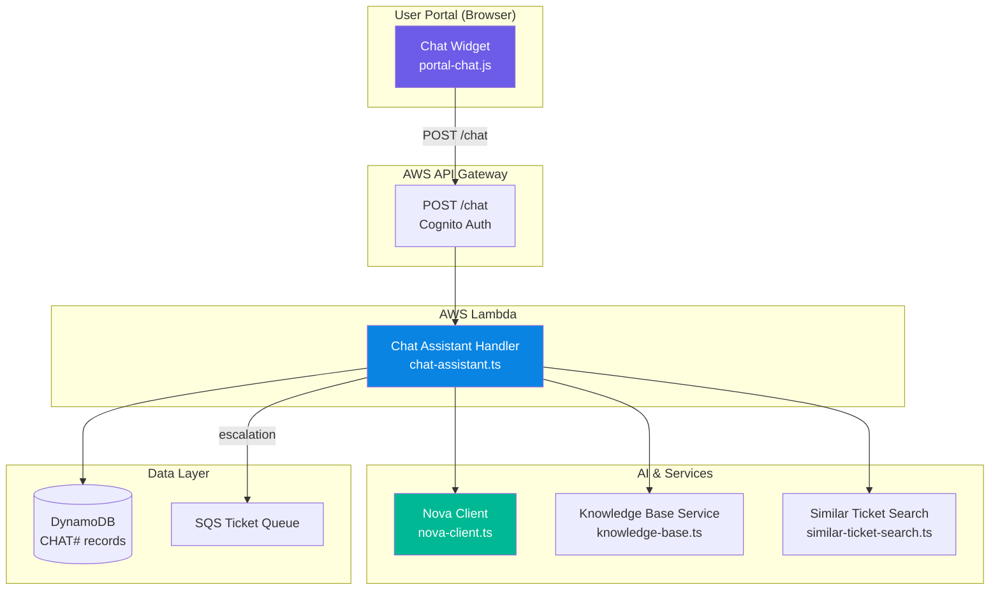

# Design Document: AI Live Chat Assistant

## Overview

The AI Live Chat Assistant adds a real-time conversational support interface to the NovaSupport user portal. The system consists of two main parts:

1. A backend Lambda handler (`src/handlers/chat-assistant.ts`) that orchestrates AI-powered message processing — classifying issues, searching the knowledge base and similar tickets, generating responses with confidence scores, and handling escalation by creating tickets with full chat context.

2. A frontend chat widget (`user-portal/portal-chat.js`) that provides a floating chat bubble, message window, typing indicators, escalation controls, and satisfaction feedback — all in vanilla JS consistent with the existing portal.

Chat sessions are persisted in the same DynamoDB table using `CHAT#{sessionId}` partition keys, and the Lambda is exposed via a new `POST /chat` route on the existing API Gateway with Cognito auth.

## Architecture



### Request Flow

1. User types message in Chat Widget
2. Widget sends `POST /chat` with `{ message, sessionId, userId, conversationHistory }`
3. API Gateway validates Cognito token, forwards to Lambda
4. Chat Assistant Handler:
   a. Stores user message in DynamoDB (`CHAT#{sessionId}`, `MESSAGE#{timestamp}`)
   b. Calls Nova AI to classify issue type (billing/technical/account/general)
   c. Searches knowledge base for relevant articles
   d. Searches similar tickets for past resolutions
   e. Calls Nova AI to generate response using all context
   f. Calculates confidence score
   g. Stores assistant message in DynamoDB
   h. Returns response with confidence, category, and suggested actions
5. Widget displays response, typing indicator removed
6. If escalation requested: handler creates ticket via existing create-ticket flow, routes to team

## Components and Interfaces

### 1. Chat Assistant Handler (`src/handlers/chat-assistant.ts`)

The main Lambda handler that processes chat requests.

```typescript
// Request body
interface ChatRequest {
  message: string;
  sessionId: string;
  userId: string;
  conversationHistory: ChatMessage[];
  action?: 'message' | 'escalate';  // default: 'message'
}

// Response body
interface ChatResponse {
  sessionId: string;
  response: string;
  confidence: number;           // 0-1
  category: IssueCategory;      // billing | technical | account | general
  suggestedActions: string[];
  referencedArticles: string[];
  escalation?: {
    ticketId: string;
    assignedTeam: string;
  };
}

// Chat message structure
interface ChatMessage {
  role: 'user' | 'assistant';
  content: string;
  timestamp: string;
}

type IssueCategory = 'billing' | 'technical' | 'account' | 'general';
```

Key functions:
- `handler(event)` — Lambda entry point, routes to message processing or escalation
- `processMessage(request)` — Orchestrates classification → search → response generation
- `classifyIssue(message, history)` — Uses Nova AI to classify into one of four categories
- `generateChatResponse(message, history, kbResults, similarTickets, category)` — Uses Nova AI to generate contextual response
- `calculateChatConfidence(kbResults, similarTickets)` — Computes confidence from search result quality
- `handleEscalation(request)` — Creates ticket with chat transcript, routes to team

### 2. Issue Classification

Uses the existing `invokeNova2Lite` from `nova-client.ts` with a classification prompt:

```typescript
// Classification prompt template
const CLASSIFICATION_PROMPT = `Classify the following customer support message into exactly one category.
Categories: billing, technical, account, general

Message: {message}

Recent conversation context:
{history}

Respond with ONLY the category name, nothing else.`;
```

Category-to-team mapping:
| Category   | Team ID              |
|-----------|----------------------|
| billing    | billing              |
| technical  | technical-support    |
| account    | account-management   |
| general    | general-support      |

### 3. Chat Widget (`user-portal/portal-chat.js`)

A self-contained vanilla JS module following the existing IIFE pattern (like `PortalAuth`, `PortalAPI`).

```javascript
const PortalChat = (() => {
  // State
  let isOpen = false;
  let sessionId = null;
  let messages = [];

  return {
    init(),           // Create DOM elements, bind events
    toggle(),         // Open/close chat window
    sendMessage(),    // Send user message to API
    handleResponse(), // Display AI response
    escalate(),       // Trigger escalation flow
    renderMessages(), // Render message list
    showTyping(),     // Show/hide typing indicator
    sendFeedback(),   // Handle thumbs up/down
  };
})();
```

UI structure:
- Floating button: fixed bottom-right, circular, with chat icon
- Chat window: 380px wide, 500px tall, with header, message area, input bar
- Message bubbles: user messages right-aligned (accent color), AI messages left-aligned (surface color)
- Typing indicator: three animated dots
- Escalation button: appears below each AI response
- Feedback: thumbs up/down icons after each AI response

### 4. Chat Session DynamoDB Schema

Stored in the same DynamoDB table as tickets:

```typescript
interface ChatMessageRecord {
  PK: string;        // "CHAT#{sessionId}"
  SK: string;        // "MESSAGE#{timestamp}"  (ISO 8601 for natural ordering)
  sessionId: string;
  userId: string;
  role: 'user' | 'assistant';
  content: string;
  category?: IssueCategory;
  confidence?: number;
  timestamp: string;  // ISO 8601
}

interface ChatSessionRecord {
  PK: string;        // "CHAT#{sessionId}"
  SK: string;        // "METADATA"
  sessionId: string;
  userId: string;
  category?: IssueCategory;
  escalatedTicketId?: string;
  createdAt: string;
  updatedAt: string;
}
```

### 5. CDK Stack Updates (`lib/novasupport-stack.ts`)

Add to the existing stack:
- New Lambda function `ChatAssistantFunction` with handler `src/handlers/chat-assistant.handler`
- New API Gateway resource `/chat` with POST method
- Cognito authorizer (reuse existing `cognitoAuthorizer`)
- Lambda timeout: 30s, memory: 1024 MB

## Data Models

### Chat Message Record

| Field       | Type   | Description                                    |
|------------|--------|------------------------------------------------|
| PK          | string | `CHAT#{sessionId}`                             |
| SK          | string | `MESSAGE#{timestamp}` (ISO 8601)               |
| sessionId   | string | Unique session identifier                      |
| userId      | string | User email from Cognito                        |
| role        | string | `user` or `assistant`                          |
| content     | string | Message text                                   |
| category    | string | Issue classification (on assistant messages)   |
| confidence  | number | AI confidence score (on assistant messages)    |
| timestamp   | string | ISO 8601 timestamp                             |

### Chat Session Metadata Record

| Field              | Type   | Description                          |
|-------------------|--------|--------------------------------------|
| PK                 | string | `CHAT#{sessionId}`                   |
| SK                 | string | `METADATA`                           |
| sessionId          | string | Unique session identifier            |
| userId             | string | User email                           |
| category           | string | Latest classified category           |
| escalatedTicketId  | string | Ticket ID if escalated               |
| createdAt          | string | ISO 8601                             |
| updatedAt          | string | ISO 8601                             |

### Category-to-Team Mapping

| Category   | Team ID              | Description                    |
|-----------|----------------------|--------------------------------|
| billing    | billing              | Billing and payment issues     |
| technical  | technical-support    | Technical/product issues       |
| account    | account-management   | Account access and settings    |
| general    | general-support      | General inquiries              |


## Correctness Properties

*A property is a characteristic or behavior that should hold true across all valid executions of a system — essentially, a formal statement about what the system should do. Properties serve as the bridge between human-readable specifications and machine-verifiable correctness guarantees.*

### Property 1: Classification output validity

*For any* user message string and conversation history, the `classifyIssue` function SHALL return exactly one value from the set `{ "billing", "technical", "account", "general" }`.

**Validates: Requirements 1.2**

### Property 2: Confidence score bounds

*For any* combination of knowledge base results (array of objects with `relevanceScore` in [0,1]) and similar tickets (array of objects with `similarityScore` in [0,1] and `wasSuccessful` boolean), the `calculateChatConfidence` function SHALL return a value in the range [0, 1] inclusive.

**Validates: Requirements 1.4**

### Property 3: Chat message record correctness

*For any* valid sessionId, userId, role, content, and timestamp, the constructed `ChatMessageRecord` SHALL have `PK` equal to `"CHAT#{sessionId}"`, `SK` equal to `"MESSAGE#{timestamp}"`, and all fields (sessionId, userId, role, content, timestamp) present and non-empty.

**Validates: Requirements 2.1, 2.2**

### Property 4: Message retrieval ordering

*For any* set of chat messages with arbitrary timestamps stored in a session, retrieving messages for that session SHALL return them sorted by timestamp in ascending order (i.e., for consecutive messages `m[i]` and `m[i+1]`, `m[i].timestamp <= m[i+1].timestamp`).

**Validates: Requirements 2.4**

### Property 5: Escalation ticket content completeness

*For any* conversation history (non-empty array of chat messages) and any valid issue category, the escalation function SHALL produce a ticket where the description contains every message's content from the conversation history, and the subject contains the issue category string.

**Validates: Requirements 3.1, 3.4**

### Property 6: Category-to-team mapping correctness

*For any* valid issue category in `{ "billing", "technical", "account", "general" }`, the `getCategoryTeam` mapping function SHALL return the corresponding team ID: billing → "billing", technical → "technical-support", account → "account-management", general → "general-support".

**Validates: Requirements 3.2**

### Property 7: Input validation rejects incomplete requests

*For any* request object that is missing at least one of the required fields (message, sessionId, userId), the `validateChatRequest` function SHALL return a non-empty array of validation error strings, and the handler SHALL return HTTP status 400.

**Validates: Requirements 5.4**

## Error Handling

| Scenario | Handling | Response |
|----------|----------|----------|
| Nova AI unavailable | Catch `NovaUnavailableError`, return fallback | `{ response: "I'm temporarily unable to process your request. Please try again or create a ticket manually.", confidence: 0 }` |
| Invalid request body | Validate required fields before processing | 400 with `{ error: { code: "VALIDATION_ERROR", message: "...", details: [...] } }` |
| Invalid JSON body | JSON.parse try/catch | 400 with `{ error: { code: "INVALID_JSON", message: "Request body must be valid JSON" } }` |
| DynamoDB write failure | Catch and log, still return response to user | 500 with `{ error: { code: "INTERNAL_ERROR", message: "..." } }` |
| Classification returns unexpected value | Default to "general" category | Continue processing with general category |
| Escalation ticket creation failure | Catch error, inform user | Return response indicating escalation failed, suggest creating ticket manually |
| Knowledge base search failure | Catch and continue without KB results | Generate response with reduced confidence |
| Similar ticket search failure | Catch and continue without similar tickets | Generate response with reduced confidence |

## Testing Strategy

### Unit Tests

Unit tests cover specific examples, edge cases, and integration points:

- Classification with known billing/technical/account/general messages
- Confidence calculation with empty KB results and empty similar tickets
- Confidence calculation with high-relevance KB results
- Escalation with empty conversation history (edge case)
- Nova unavailability fallback response
- Request validation with various missing field combinations
- Chat message record construction with correct PK/SK format
- Category-to-team mapping for all four categories
- Message retrieval ordering verification

### Unit Test Coverage

Unit tests provide comprehensive coverage of all backend logic:

- Issue classification returns valid category for billing/technical/account/general messages
- Confidence score calculation with various KB and similar ticket combinations
- Chat message record construction with correct PK/SK format and all required fields
- Message retrieval returns messages in timestamp-ascending order
- Escalation produces ticket with full transcript in description and category in subject
- Category-to-team mapping for all four categories
- Input validation rejects requests missing required fields
- Nova unavailability returns fallback response
- Empty conversation history edge cases
- Classification fallback to "general" on unexpected AI output
