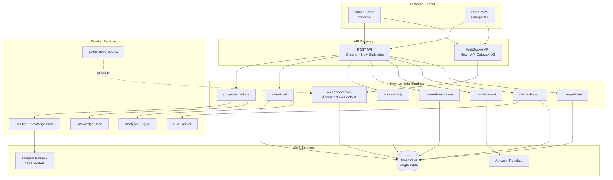

# Design Document: Enhanced Features Bundle

## Overview

This design covers eight features that extend the NovaSupport IT ticket management system: AI-Suggested Solutions, Satisfaction Rating Widget, Ticket Timeline/Activity Log, Canned Responses, Multi-language Support, Real-time WebSocket Notifications, Admin SLA Dashboard, and Ticket Merge. All features integrate into the existing AWS serverless architecture (CDK, Lambda, DynamoDB single-table, API Gateway REST, Cognito) and follow established patterns for handlers, services, and static frontend portals.

Key design decisions:
- All new DynamoDB records follow the existing single-table PK/SK pattern with GSI projections where needed.
- New Lambda handlers follow the existing pattern: one handler per endpoint, shared `lambdaRole`, `lambdaEnvironment`, and `dist` code asset.
- The WebSocket API is a separate API Gateway V2 resource (not part of the existing REST API) with its own Lambda handlers.
- Amazon Translate is used for multi-language support; Amazon Nova models are used for AI-suggested solutions.
- Frontend changes are static HTML/JS with no build step — changes are picked up on hard refresh.

## Architecture



### Request Flow Patterns

1. **AI-Suggested Solutions**: Admin Portal → `GET /tickets/{id}/suggestions` → `suggest-solutions` handler → calls `findMatchingSolutions()` on Solution KB → falls back to Knowledge Base search if no results above 0.5 threshold → returns ranked suggestions.

2. **Satisfaction Rating**: User Portal → `PUT /tickets/{id}/rate` → `rate-ticket` handler → validates ticket is resolved/closed → updates TicketRecord with rating → writes satisfaction metric via Analytics Engine.

3. **Activity Log**: Any status/message/assignment/escalation/resolution event → existing handlers create Activity_Record in DynamoDB → Portal fetches `GET /tickets/{id}/activity` → `ticket-activity` handler queries by PK with SK prefix `ACTIVITY#` → returns sorted timeline.

4. **Canned Responses**: Admin Portal → CRUD via `/admin/canned-responses` → `canned-responses` handler → DynamoDB operations on `CANNED_RESPONSE#` records. Admin selects template → frontend replaces `{{ticketId}}`, `{{userName}}` tokens → inserts into message input.

5. **Multi-language**: Ticket creation → `create-ticket` handler calls Amazon Translate `TranslateText` with auto-detect → stores `detectedLanguage`, `translatedSubject`, `translatedDescription`. Admin reply → `ticket-messages` handler translates English to detected language. Standalone `POST /translate` endpoint available.

6. **WebSocket Notifications**: CDK provisions API Gateway V2 WebSocket API → `$connect` stores connection in DynamoDB → `$disconnect` removes it. When ticket events occur, Notification Service queries connections for relevant users → posts messages via `ApiGatewayManagementApi`. Portals connect on load, reconnect with exponential backoff, fall back to polling.

7. **SLA Dashboard**: Admin Portal → `GET /admin/sla-dashboard` → `sla-dashboard` handler → queries all open tickets via GSI2 → computes metrics using `SLA_Tracker.getSLAStatus()` for each → aggregates breach counts, at-risk counts, compliance percentages, per-priority breakdowns.

8. **Ticket Merge**: Admin Portal → `POST /tickets/{id}/merge` with `primaryTicketId` → `merge-ticket` handler → validates (not self-merge, not already merged) → copies messages and attachments to primary → closes duplicate → creates Merge_Record and Activity_Records on both tickets.


## Components and Interfaces

### New Lambda Handlers

#### 1. `src/handlers/suggest-solutions.ts`
- **Trigger**: `GET /tickets/{ticketId}/suggestions`
- **Auth**: Cognito (admin pool)
- **Logic**:
  1. Fetch ticket record by `ticketId`
  2. Call `findMatchingSolutions(subject + ' ' + description, { limit: 5, minSimilarity: 0.5 })`
  3. If results found, return them ranked by success rate then similarity
  4. If no results above 0.5, call Knowledge Base `searchArticles(subject + ' ' + description)`
  5. Return combined results or empty message
- **Response**: `{ suggestions: SuggestionItem[], source: 'solutions' | 'articles' | 'none' }`

#### 2. `src/handlers/rate-ticket.ts`
- **Trigger**: `PUT /tickets/{ticketId}/rate`
- **Auth**: Cognito (portal user pool)
- **Logic**:
  1. Validate ticket exists and status is `resolved` or `closed`
  2. Validate rating is integer 1–5, feedback is string ≤500 chars
  3. Update TicketRecord: set `satisfactionRating`, `satisfactionFeedback`, `ratedAt`
  4. Write metric record: `PK=METRIC#<date>`, `SK=satisfaction#<ticketId>`
- **Response**: `{ success: true, rating, feedback }`

#### 3. `src/handlers/ticket-activity.ts`
- **Trigger**: `GET /tickets/{ticketId}/activity?page=1&limit=50`
- **Auth**: Cognito (both pools)
- **Logic**:
  1. Query DynamoDB: `PK = TICKET#<ticketId>` and `SK begins_with ACTIVITY#`
  2. If caller is from portal user pool, filter to only `status_change`, `message`, `resolution` types
  3. Sort by SK ascending (timestamp-based)
  4. Paginate: return up to `limit` items, include `lastEvaluatedKey` for next page
- **Response**: `{ activities: ActivityRecord[], nextPageKey?: string }`

#### 4. `src/handlers/canned-responses.ts`
- **Trigger**: `/admin/canned-responses` — GET, POST, PUT, DELETE
- **Auth**: Cognito (admin pool)
- **Logic**:
  - **GET**: Scan all `CANNED_RESPONSE#` records, sort by category then title
  - **POST**: Validate title non-empty, body non-empty, category in `TICKET_CATEGORIES`. Check uniqueness (title+category). Store with `PK=CANNED_RESPONSE#<id>`, `SK=METADATA`
  - **PUT**: Update existing record by id
  - **DELETE**: Delete record by id
- **Response**: Standard CRUD responses

#### 5. `src/handlers/translate-text.ts`
- **Trigger**: `POST /translate`
- **Auth**: Cognito (both pools)
- **Logic**:
  1. Accept `{ text, targetLanguage }` in body
  2. Call Amazon Translate `TranslateText` with `SourceLanguageCode: 'auto'`
  3. Return `{ originalText, detectedLanguage, translatedText, targetLanguage }`
- **Response**: `TranslationResult`

#### 6. `src/handlers/ws-connect.ts`, `ws-disconnect.ts`, `ws-default.ts`
- **Trigger**: API Gateway V2 WebSocket routes `$connect`, `$disconnect`, `$default`
- **Logic**:
  - **$connect**: Extract `userId` from query string `token` (decode JWT). Store `WSCONN#<connectionId>` with `userId`, `connectedAt`. Also store reverse lookup: `GSI1PK=WSUSER#<userId>`, `GSI1SK=<connectionId>`
  - **$disconnect**: Delete `WSCONN#<connectionId>` record
  - **$default**: No-op (messages are server-push only)
- **Response**: `{ statusCode: 200 }`

#### 7. `src/handlers/sla-dashboard.ts`
- **Trigger**: `GET /admin/sla-dashboard`
- **Auth**: Cognito (admin pool)
- **Logic**:
  1. Query all open tickets (status not `resolved`/`closed`) via GSI2
  2. For each ticket, compute SLA status using `getSLAStatus()`
  3. Aggregate: total open, breached count, at-risk count (≤30 min remaining), compliance %, avg response time, avg resolution time
  4. Break down by priority level
- **Response**: `{ metrics: SLADashboardMetrics }`

#### 8. `src/handlers/merge-ticket.ts`
- **Trigger**: `POST /tickets/{ticketId}/merge`
- **Auth**: Cognito (admin pool)
- **Logic**:
  1. Validate `ticketId !== primaryTicketId` (400 if same)
  2. Validate duplicate ticket not already merged (check `mergedInto` attribute) (400 if merged)
  3. Fetch both ticket records
  4. Append duplicate description to primary with separator
  5. Query and copy all `MESSAGE#` records from duplicate to primary (new SK with original timestamp preserved)
  6. Copy attachment references
  7. Close duplicate: set status `closed`, `mergedInto = primaryTicketId`
  8. Create `MERGE_INFO` record on duplicate
  9. Create `ACTIVITY#` records on both tickets (type `merge`)
- **Response**: `{ success: true, primaryTicketId, duplicateTicketId }`

### Modifications to Existing Handlers

#### `src/handlers/create-ticket.ts` (Multi-language)
- After creating the ticket, call Amazon Translate to detect language
- If non-English, translate subject and description
- Store `detectedLanguage`, `translatedSubject`, `translatedDescription` on TicketRecord

#### `src/handlers/ticket-messages.ts` (Multi-language + Activity Log)
- On POST: if ticket has `detectedLanguage` !== 'en', translate admin message to detected language, store both `content` and `translatedContent`
- On POST: create an Activity_Record with type `message`

#### `src/handlers/update-ticket-status.ts` (Activity Log + WebSocket)
- On status change: create Activity_Record with type `status_change`
- On assignment: create Activity_Record with type `assignment`
- After update: call WebSocket broadcast for relevant users

#### `src/handlers/resolve-ticket.ts` (Activity Log + WebSocket)
- On resolution: create Activity_Record with type `resolution`
- After resolution: call WebSocket broadcast

#### `src/services/notification-service.ts` (WebSocket)
- Add `broadcastToConnections(userIds: string[], message: WebSocketMessage)` function
- Query `WSUSER#<userId>` from GSI1 to find all connections
- Use `ApiGatewayManagementApi.postToConnection()` to send messages
- Handle stale connections (delete on `GoneException`)

### Frontend Changes

#### Admin Portal (`frontend/`)
- **Suggested Solutions Panel**: In ticket detail view, add a collapsible panel that auto-fetches suggestions on load. Show loading spinner, then ranked solution cards with "Apply Solution", "Helpful", "Not Helpful" buttons.
- **Canned Responses Dropdown**: In Messages tab, add a grouped dropdown above the message input. On selection, replace tokens and insert into textarea.
- **Translation Toggle**: In ticket detail, if `detectedLanguage !== 'en'`, show original/translated toggle for subject and description.
- **Activity Timeline**: In ticket detail, add a Timeline tab showing vertical timeline with icons per activity type.
- **SLA Dashboard**: New sidebar nav item → dedicated view with metric cards, breached/at-risk ticket lists, priority breakdown table.
- **Merge Button**: In ticket detail, add "Merge Ticket" button → modal with ticket search → confirm merge.
- **WebSocket**: On load, connect to WebSocket API. On `ticket_update` message, refresh ticket status badges. On `new_message`, show notification toast. Reconnect with exponential backoff.

#### User Portal (`user-portal/`)
- **Rating Widget**: On resolved ticket view, show 5-star rating widget with optional feedback textarea (500 char limit with counter). Display existing rating if already submitted.
- **Translation Display**: Show messages in detected language with "View original" toggle.
- **Activity Timeline**: Show filtered timeline (status_change, message, resolution only).
- **Merge Notice**: On merged ticket, show banner with link to primary ticket.
- **WebSocket**: Same connection/reconnect pattern as admin portal.


## Data Models

All new records use the existing single-table DynamoDB design with `PK`/`SK` keys and GSI projections.

### Activity Record

```typescript
interface ActivityRecord {
  PK: string;          // "TICKET#<ticketId>"
  SK: string;          // "ACTIVITY#<ISO-timestamp>#<activityId>"
  activityId: string;  // "ACT-<uuid>"
  ticketId: string;
  type: 'status_change' | 'message' | 'assignment' | 'resolution' | 'escalation' | 'merge';
  actor: string;       // userId or "system"
  timestamp: string;   // ISO 8601
  details: {
    oldStatus?: string;
    newStatus?: string;
    contentPreview?: string;    // first 100 chars for messages
    previousAssignee?: string;
    newAssignee?: string;
    escalationReason?: string;
    urgencyLevel?: string;
    primaryTicketId?: string;   // for merge events
    duplicateTicketId?: string; // for merge events
  };
}
```

### Canned Response Record

```typescript
interface CannedResponseRecord {
  PK: string;         // "CANNED_RESPONSE#<responseId>"
  SK: string;         // "METADATA"
  responseId: string;  // "CR-<uuid>"
  title: string;
  body: string;        // may contain {{ticketId}}, {{userName}} tokens
  category: string;    // one of TICKET_CATEGORIES
  createdBy: string;
  createdAt: string;
  updatedAt: string;
}
```

### WebSocket Connection Record

```typescript
interface WebSocketConnectionRecord {
  PK: string;          // "WSCONN#<connectionId>"
  SK: string;          // "METADATA"
  connectionId: string;
  userId: string;
  connectedAt: string;
  // GSI1 for reverse lookup by userId
  GSI1PK: string;     // "WSUSER#<userId>"
  GSI1SK: string;     // "<connectionId>"
  // TTL for auto-cleanup of stale connections (24h)
  ttl: number;
}
```

### Merge Record

```typescript
interface MergeRecord {
  PK: string;          // "TICKET#<duplicateTicketId>"
  SK: string;          // "MERGE_INFO"
  primaryTicketId: string;
  mergedAt: string;
  mergedBy: string;    // admin userId
}
```

### Extensions to Existing TicketRecord

```typescript
// New fields added to TicketRecord
interface TicketRecordExtensions {
  satisfactionRating?: number;     // 1–5
  satisfactionFeedback?: string;   // up to 500 chars
  ratedAt?: string;                // ISO 8601
  detectedLanguage?: string;       // ISO 639-1 code (e.g., 'en', 'es', 'fr')
  translatedSubject?: string;
  translatedDescription?: string;
  translationFailed?: boolean;
  mergedInto?: string;             // primaryTicketId if this ticket was merged
}
```

### Extensions to Existing MessageRecord

```typescript
// New fields added to MessageRecord
interface MessageRecordExtensions {
  translatedContent?: string;      // message translated to ticket's detected language
  sourceLanguage?: string;         // language of original content
}
```

### WebSocket Message Types

```typescript
interface WebSocketMessage {
  type: 'ticket_update' | 'new_message' | 'ticket_merged';
  ticketId: string;
  timestamp: string;
  data: {
    newStatus?: string;
    sender?: string;
    contentPreview?: string;
    primaryTicketId?: string;
  };
}
```

### SLA Dashboard Metrics

```typescript
interface SLADashboardMetrics {
  totalOpen: number;
  breachedCount: number;
  atRiskCount: number;           // within 30 min of breach
  compliancePercentage: number;  // (totalOpen - breachedCount) / totalOpen * 100
  avgResponseTimeMinutes: number;
  avgResolutionTimeMinutes: number;
  byPriority: {
    priority: string;            // 'Critical' | 'High' | 'Medium' | 'Low'
    total: number;
    breached: number;
    compliancePercentage: number;
  }[];
  breachedTickets: {
    ticketId: string;
    subject: string;
    priority: number;
    timeSinceBreachMinutes: number;
    assignedTeam?: string;
  }[];
  atRiskTickets: {
    ticketId: string;
    subject: string;
    priority: number;
    timeRemainingMinutes: number;
    assignedTeam?: string;
  }[];
}
```

### New API Endpoints Summary

| Method | Path | Handler | Auth |
|--------|------|---------|------|
| GET | `/tickets/{ticketId}/suggestions` | suggest-solutions | Admin |
| PUT | `/tickets/{ticketId}/rate` | rate-ticket | Portal User |
| GET | `/tickets/{ticketId}/activity` | ticket-activity | Both |
| GET | `/admin/canned-responses` | canned-responses | Admin |
| POST | `/admin/canned-responses` | canned-responses | Admin |
| PUT | `/admin/canned-responses/{responseId}` | canned-responses | Admin |
| DELETE | `/admin/canned-responses/{responseId}` | canned-responses | Admin |
| POST | `/translate` | translate-text | Both |
| WSS | `$connect` | ws-connect | Query token |
| WSS | `$disconnect` | ws-disconnect | — |
| WSS | `$default` | ws-default | — |
| GET | `/admin/sla-dashboard` | sla-dashboard | Admin |
| POST | `/tickets/{ticketId}/merge` | merge-ticket | Admin |

### CDK Infrastructure Additions

```typescript
// In lib/novasupport-stack.ts constructor:

// 1. Amazon Translate permissions on lambdaRole
lambdaRole.addToPolicy(new iam.PolicyStatement({
  effect: iam.Effect.ALLOW,
  actions: ['translate:TranslateText', 'translate:DetectDominantLanguage'],
  resources: ['*'],
}));

// 2. API Gateway V2 WebSocket API
const wsApi = new apigatewayv2.WebSocketApi(this, 'NovaSupportWebSocketApi', {
  apiName: 'NovaSupport-WebSocket',
  connectRouteOptions: {
    integration: new WebSocketLambdaIntegration('ConnectIntegration', wsConnectFunction),
  },
  disconnectRouteOptions: {
    integration: new WebSocketLambdaIntegration('DisconnectIntegration', wsDisconnectFunction),
  },
  defaultRouteOptions: {
    integration: new WebSocketLambdaIntegration('DefaultIntegration', wsDefaultFunction),
  },
});

const wsStage = new apigatewayv2.WebSocketStage(this, 'WebSocketStage', {
  webSocketApi: wsApi,
  stageName: 'dev',
  autoDeploy: true,
});

// 3. Grant execute-api:ManageConnections to notification service Lambda
lambdaRole.addToPolicy(new iam.PolicyStatement({
  effect: iam.Effect.ALLOW,
  actions: ['execute-api:ManageConnections'],
  resources: [`arn:aws:execute-api:${this.region}:${this.account}:${wsApi.apiId}/*`],
}));

// 4. Pass WebSocket endpoint to Lambda environment
lambdaEnvironment['WEBSOCKET_ENDPOINT'] = wsStage.callbackUrl;
```


## Correctness Properties

*A property is a characteristic or behavior that should hold true across all valid executions of a system — essentially, a formal statement about what the system should do. Properties serve as the bridge between human-readable specifications and machine-verifiable correctness guarantees.*

### Property 1: Solution suggestions are ranked by success rate then similarity, capped at 5

*For any* set of solution matches returned by `findMatchingSolutions`, the results should be sorted in descending order by success rate first, then by similarity score second, and the total count should not exceed 5.

**Validates: Requirements 1.2**

### Property 2: Fallback to Knowledge Base when no solutions found

*For any* ticket query where `findMatchingSolutions` returns zero results above the 0.5 similarity threshold, the suggest-solutions handler should call the Knowledge Base search and return article results. If both return empty, the response source should be `'none'`.

**Validates: Requirements 1.7, 1.8**

### Property 3: Rating persistence round-trip

*For any* resolved or closed ticket and any valid rating (integer 1–5) with optional feedback (≤500 chars), submitting the rating and then reading the ticket back should return the same rating and feedback values. Submitting a second rating should overwrite the first — reading back should always reflect the most recent submission.

**Validates: Requirements 2.4, 2.6**

### Property 4: Rating rejected for non-resolved tickets

*For any* ticket with status not in `{resolved, closed}`, submitting a rating should be rejected with a 400 error.

**Validates: Requirements 2.5**

### Property 5: Rating creates satisfaction metric

*For any* successful rating submission, a metric record with type `"satisfaction"` and the submitted rating value should be created in DynamoDB with PK `METRIC#<date>` and SK containing `satisfaction#<ticketId>`.

**Validates: Requirements 2.7**

### Property 6: Feedback text length validation

*For any* feedback string longer than 500 characters, the rating endpoint should reject the request. *For any* feedback string of 500 characters or fewer (including empty), the request should be accepted.

**Validates: Requirements 2.9**

### Property 7: Activity record creation for ticket events

*For any* ticket event (status change, message post, assignment, resolution, or escalation), an Activity_Record should be created with the correct `type`, `actor`, `timestamp`, and `details` fields matching the event. For status changes, `details` should contain `oldStatus` and `newStatus`. For messages, `details.contentPreview` should be the first 100 characters of the message content. For assignments, `details` should contain `previousAssignee` and `newAssignee`.

**Validates: Requirements 3.1, 3.2, 3.3, 3.4, 3.5**

### Property 8: Activity timeline sorted ascending by timestamp

*For any* set of Activity_Records returned by the ticket-activity handler, the records should be sorted by timestamp in ascending order.

**Validates: Requirements 3.6**

### Property 9: User portal activity filtering

*For any* set of Activity_Records returned to a portal user (non-admin), none should have type `"assignment"` or `"escalation"`. Only `"status_change"`, `"message"`, and `"resolution"` types should be included.

**Validates: Requirements 3.8**

### Property 10: Activity timeline pagination limit

*For any* query to the ticket-activity endpoint, the returned page should contain at most 50 activity records.

**Validates: Requirements 3.9**

### Property 11: Canned response validation

*For any* canned response creation request, if the title is empty, the body is empty, or the category is not in `TICKET_CATEGORIES`, the request should be rejected. *For any* request with non-empty title, non-empty body, and valid category, creation should succeed.

**Validates: Requirements 4.2**

### Property 12: Canned response token replacement

*For any* canned response body containing `{{ticketId}}` and/or `{{userName}}` tokens, and any ticket context with a ticketId and userName, replacing tokens should produce a string where all `{{ticketId}}` occurrences are replaced with the actual ticketId and all `{{userName}}` occurrences are replaced with the actual userName, with no remaining `{{...}}` tokens for those keys.

**Validates: Requirements 4.4**

### Property 13: Canned responses sorted by category then title

*For any* set of canned responses returned by the list endpoint, the results should be sorted alphabetically by category first, then by title within each category.

**Validates: Requirements 4.7**

### Property 14: Canned response creation round-trip

*For any* valid canned response input (non-empty title, non-empty body, valid category), creating the response and then reading it back should return matching title, body, category, and createdBy values.

**Validates: Requirements 4.8**

### Property 15: Canned response title uniqueness within category

*For any* two canned response creation requests with the same title and same category, the second request should be rejected with a 409 conflict error.

**Validates: Requirements 4.9**

### Property 16: Language detection on ticket creation

*For any* ticket creation, the resulting TicketRecord should have a `detectedLanguage` field set to a valid ISO 639-1 language code.

**Validates: Requirements 5.1**

### Property 17: Non-English ticket translation

*For any* ticket where `detectedLanguage` is not `'en'`, the TicketRecord should have `translatedSubject` and `translatedDescription` fields populated. *For any* ticket where `detectedLanguage` is `'en'`, these fields should not be set.

**Validates: Requirements 5.2**

### Property 18: Message translation on non-English tickets

*For any* message posted by an admin on a ticket with `detectedLanguage` !== `'en'`, the MessageRecord should have both `content` (original English) and `translatedContent` (in the ticket's detected language) fields populated.

**Validates: Requirements 5.4**

### Property 19: WebSocket connection lifecycle

*For any* WebSocket connect event, a `WSCONN#<connectionId>` record should exist in DynamoDB with the correct `userId` and `connectedAt`. *For any* subsequent disconnect event for the same connectionId, the record should be deleted.

**Validates: Requirements 6.2, 6.3**

### Property 20: WebSocket broadcast on ticket events

*For any* ticket event (status change or new message) where the ticket's userId and/or assigned admin have active WebSocket connections, a WebSocket message of the appropriate type should be sent to all relevant connections.

**Validates: Requirements 6.4, 6.5**

### Property 21: WebSocket reconnect exponential backoff

*For any* sequence of reconnection attempts numbered 0, 1, 2, ..., the delay for attempt `n` should be `min(2^n * 1000, 30000)` milliseconds.

**Validates: Requirements 6.9**

### Property 22: SLA dashboard metric consistency

*For any* set of open tickets with SLA data, the computed `compliancePercentage` should equal `(totalOpen - breachedCount) / totalOpen * 100`. The `breachedCount` should equal the number of tickets where `responseBreached` or `resolutionBreached` is true. The `atRiskCount` should equal the number of non-breached tickets with response or resolution time remaining ≤30 minutes.

**Validates: Requirements 7.3**

### Property 23: Breached ticket list completeness

*For any* breached ticket in the SLA dashboard response, the record should include `ticketId`, `subject`, `priority`, `timeSinceBreachMinutes` (positive number), and `assignedTeam`.

**Validates: Requirements 7.4**

### Property 24: At-risk ticket list correctness

*For any* at-risk ticket in the SLA dashboard response, `timeRemainingMinutes` should be > 0 and ≤ 30, and the record should include `ticketId`, `subject`, `priority`, and `assignedTeam`.

**Validates: Requirements 7.5**

### Property 25: SLA per-priority breakdown consistency

*For any* SLA dashboard response, the sum of `total` across all priority breakdowns should equal `totalOpen`. Each priority's `compliancePercentage` should equal `(total - breached) / total * 100` for that priority.

**Validates: Requirements 7.7**

### Property 26: Merge preserves duplicate description on primary

*For any* merge operation, the primary ticket's description after merge should contain both the original primary description and the duplicate ticket's description, separated by a merge indicator that includes the duplicate ticket's ID.

**Validates: Requirements 8.3**

### Property 27: Merge preserves all messages

*For any* merge operation, all Message_Records that existed on the duplicate ticket should now exist under the primary ticket's PK, with original `userId`, `content`, and `createdAt` timestamps preserved.

**Validates: Requirements 8.4**

### Property 28: Merge preserves all attachments

*For any* merge operation, the primary ticket's `attachmentIds` list after merge should be a superset of the union of the original primary and duplicate attachment IDs.

**Validates: Requirements 8.5**

### Property 29: Merge closes duplicate with correct state

*For any* merge operation, the duplicate ticket should have status `"closed"`, `mergedInto` set to the primary ticket's ID, and a `MERGE_INFO` record should exist with PK `TICKET#<duplicateTicketId>` and SK `MERGE_INFO` containing the primary ticketId, merge timestamp, and admin userId.

**Validates: Requirements 8.6, 8.7**

### Property 30: Merge creates activity records on both tickets

*For any* merge operation, both the primary and duplicate tickets should have an Activity_Record with type `"merge"` containing references to the other ticket.

**Validates: Requirements 8.8**


## Error Handling

### General Patterns
All new handlers follow the existing error handling pattern: try/catch at the top level, structured error responses with `{ error: { message, details? } }`, and appropriate HTTP status codes. All errors are logged via the existing `createLogger` utility.

### Feature-Specific Error Handling

#### AI-Suggested Solutions
- **Solution KB unavailable**: Return empty suggestions with `source: 'none'` and log warning. Do not fail the ticket detail load.
- **Embedding generation failure**: Fall back to Knowledge Base text search. If both fail, return empty results.
- **Ticket not found**: Return 404.

#### Satisfaction Rating
- **Invalid rating value** (not 1–5): Return 400 with validation message.
- **Feedback too long** (>500 chars): Return 400 with "Feedback must be 500 characters or fewer."
- **Ticket not resolved/closed**: Return 400 with "Rating is only allowed on resolved or closed tickets."
- **Ticket not found**: Return 404.
- **Analytics metric write failure**: Log error but still return success (rating is the primary operation).

#### Activity Log
- **No activities found**: Return empty array (not an error).
- **Invalid pagination key**: Return 400.
- **Ticket not found**: Return 404.

#### Canned Responses
- **Validation failures** (empty title/body, invalid category): Return 400 with specific field errors.
- **Duplicate title+category**: Return 409 with "A canned response with this title already exists in this category."
- **Response not found** (PUT/DELETE): Return 404.

#### Multi-language Support
- **Amazon Translate failure**: Set `translationFailed: true` on the record, store original text only, log error. Do not fail ticket creation or message posting.
- **Unsupported language**: Amazon Translate handles this — if it can't detect, default to `'en'` and skip translation.

#### WebSocket
- **Connection storage failure**: Return 500 on `$connect` (client will retry).
- **Stale connection** (`GoneException` on postToConnection): Delete the stale connection record silently.
- **Broadcast failure**: Log error per failed connection but continue sending to remaining connections. Never fail the primary operation (status change, message post) due to WebSocket broadcast failure.

#### SLA Dashboard
- **No open tickets**: Return metrics with all zeros and empty lists.
- **Missing SLA data on ticket**: Skip ticket in SLA calculations, log warning.

#### Ticket Merge
- **Self-merge**: Return 400 with "A ticket cannot be merged into itself."
- **Already merged**: Return 400 with "This ticket has already been merged."
- **Primary ticket not found**: Return 404 with "Primary ticket not found."
- **Duplicate ticket not found**: Return 404.
- **Partial failure during merge** (e.g., messages copied but activity record fails): Log error, return 500. The merge is not atomic — partial state may exist. The admin can retry or manually clean up. Future improvement: use DynamoDB transactions for critical writes.

## Testing Strategy

### Property-Based Testing

Property-based tests use `fast-check` (already available in the project) to verify universal properties across randomly generated inputs. Each property test runs a minimum of 100 iterations.

Each property test is tagged with a comment referencing the design property:
```typescript
// Feature: enhanced-features-bundle, Property N: <property title>
```

#### Property Tests to Implement

| Property | Test File | What It Tests |
|----------|-----------|---------------|
| 1 | `test/suggest-solutions.property.test.ts` | Solution ranking (success rate → similarity, max 5) |
| 2 | `test/suggest-solutions.property.test.ts` | Fallback to KB when no solutions found |
| 3 | `test/rate-ticket.property.test.ts` | Rating round-trip persistence and overwrite |
| 4 | `test/rate-ticket.property.test.ts` | Rating rejected for non-resolved tickets |
| 5 | `test/rate-ticket.property.test.ts` | Satisfaction metric creation |
| 6 | `test/rate-ticket.property.test.ts` | Feedback length validation |
| 7 | `test/ticket-activity.property.test.ts` | Activity record creation for all event types |
| 8 | `test/ticket-activity.property.test.ts` | Timeline sorted ascending |
| 9 | `test/ticket-activity.property.test.ts` | User portal filtering |
| 10 | `test/ticket-activity.property.test.ts` | Pagination limit |
| 11 | `test/canned-responses.property.test.ts` | Validation rules |
| 12 | `test/canned-responses.property.test.ts` | Token replacement |
| 13 | `test/canned-responses.property.test.ts` | Sort order |
| 14 | `test/canned-responses.property.test.ts` | Creation round-trip |
| 15 | `test/canned-responses.property.test.ts` | Title uniqueness |
| 16 | `test/translate-text.property.test.ts` | Language detection on creation |
| 17 | `test/translate-text.property.test.ts` | Non-English translation |
| 18 | `test/translate-text.property.test.ts` | Message translation |
| 19 | `test/websocket.property.test.ts` | Connection lifecycle |
| 20 | `test/websocket.property.test.ts` | Broadcast on events |
| 21 | `test/websocket.property.test.ts` | Exponential backoff |
| 22 | `test/sla-dashboard.property.test.ts` | Metric consistency |
| 23 | `test/sla-dashboard.property.test.ts` | Breached ticket completeness |
| 24 | `test/sla-dashboard.property.test.ts` | At-risk ticket correctness |
| 25 | `test/sla-dashboard.property.test.ts` | Per-priority breakdown consistency |
| 26 | `test/merge-ticket.property.test.ts` | Description preservation |
| 27 | `test/merge-ticket.property.test.ts` | Message preservation |
| 28 | `test/merge-ticket.property.test.ts` | Attachment preservation |
| 29 | `test/merge-ticket.property.test.ts` | Duplicate post-merge state |
| 30 | `test/merge-ticket.property.test.ts` | Activity records on both tickets |

### Unit Tests

Unit tests complement property tests by covering specific examples, edge cases, and integration points. They use Jest (already configured).

| Test File | Coverage |
|-----------|----------|
| `test/suggest-solutions.test.ts` | Empty ticket description, KB fallback with no articles, solution with 0 success/failure counts |
| `test/rate-ticket.test.ts` | Rating value boundary (1, 5), empty feedback, exactly 500 char feedback, ticket not found |
| `test/ticket-activity.test.ts` | Empty timeline, message preview truncation at 100 chars, pagination with exactly 50 items |
| `test/canned-responses.test.ts` | CRUD happy path, duplicate detection, category validation against TICKET_CATEGORIES |
| `test/translate-text.test.ts` | English text (no translation needed), Translate API failure with translationFailed flag, standalone /translate endpoint |
| `test/ws-connect.test.ts` | Connection storage, disconnect cleanup, stale connection handling (GoneException) |
| `test/sla-dashboard.test.ts` | No open tickets (all zeros), all tickets breached (0% compliance), mixed priorities |
| `test/merge-ticket.test.ts` | Self-merge rejection, already-merged rejection, merge with no messages, merge with no attachments |

### Testing Configuration

- Property tests: minimum 100 iterations per property via `fast-check`
- Unit tests: Jest with existing configuration
- All tests mock DynamoDB, Amazon Translate, and Bedrock calls
- WebSocket tests mock `ApiGatewayManagementApi`
- Each property test file imports `fc` from `fast-check` and uses `fc.assert(fc.property(...))` pattern
