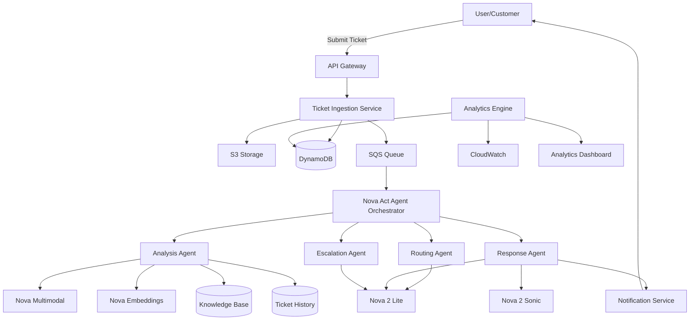

# Design Document: NovaSupport – Agentic AI Support Ticket System

## Overview

NovaSupport is an intelligent, agentic AI support ticket system that leverages Amazon Nova's multimodal and reasoning capabilities to automate customer support workflows. The system uses a multi-agent architecture orchestrated by Nova Act, where specialized agents handle different aspects of ticket processing: routing, analysis, response generation, escalation, and analytics.

The design emphasizes:
- **Agentic autonomy**: AI agents make decisions and take actions with minimal human intervention
- **Multimodal understanding**: Process text, images, videos, documents, and voice inputs
- **Intelligent reasoning**: Use Nova 2 Lite for fast, context-aware decision-making
- **Scalable architecture**: Serverless AWS infrastructure for hackathon deployment
- **Graceful degradation**: Human escalation when AI confidence is low

## Architecture

### High-Level Architecture



### Agent Workflow Architecture

The system uses Nova Act to orchestrate a fleet of specialized agents:

1. **Routing Agent**: Analyzes ticket content and assigns to appropriate team
2. **Analysis Agent**: Processes multimodal attachments and searches knowledge base
3. **Response Agent**: Generates contextual responses and handles voice I/O
4. **Escalation Agent**: Monitors confidence and determines when human intervention is needed
5. **Analytics Agent**: Tracks metrics, detects trends, and generates alerts

Each agent operates independently but shares context through Nova Act's state management.

### Technology Stack

- **AI Models**: Amazon Nova 2 Lite, Nova 2 Sonic, Nova Multimodal, Nova Embeddings
- **Agent Orchestration**: Amazon Nova Act
- **Compute**: AWS Lambda (serverless functions)
- **Storage**: Amazon S3 (attachments), DynamoDB (metadata, tickets)
- **Messaging**: Amazon SQS (async processing)
- **Monitoring**: Amazon CloudWatch
- **API**: Amazon API Gateway
- **Search**: Vector search using Nova Embeddings + DynamoDB or OpenSearch

## Components and Interfaces

### 1. Ticket Ingestion Service

**Responsibility**: Receive and validate incoming support tickets

**Interface**:
```typescript
interface TicketIngestionService {
  createTicket(request: CreateTicketRequest): Promise<Ticket>
  attachFile(ticketId: string, file: File): Promise<Attachment>
  submitVoiceTicket(audio: AudioFile): Promise<Ticket>
}

interface CreateTicketRequest {
  userId: string
  subject: string
  description: string
  attachments?: File[]
  priority?: Priority
  metadata?: Record<string, any>
}

interface Ticket {
  id: string
  userId: string
  subject: string
  description: string
  status: TicketStatus
  priority: Priority
  assignedTo?: string
  createdAt: Date
  updatedAt: Date
  tags: string[]
  attachments: Attachment[]
}

enum TicketStatus {
  NEW = "new",
  ANALYZING = "analyzing",
  ASSIGNED = "assigned",
  IN_PROGRESS = "in_progress",
  PENDING_USER = "pending_user",
  RESOLVED = "resolved",
  CLOSED = "closed"
}

enum Priority {
  LOW = 1,
  MEDIUM = 5,
  HIGH = 8,
  CRITICAL = 10
}
```

**Implementation Notes**:
- Validates ticket data and sanitizes inputs
- Stores attachments in S3 with signed URLs
- Writes ticket metadata to DynamoDB
- Publishes ticket to SQS for agent processing
- Returns ticket ID immediately (async processing)

### 2. Nova Act Agent Orchestrator

**Responsibility**: Coordinate multi-agent workflows for ticket processing

**Interface**:
```typescript
interface AgentOrchestrator {
  processTicket(ticketId: string): Promise<WorkflowResult>
  getWorkflowStatus(workflowId: string): Promise<WorkflowStatus>
  retryFailedStep(workflowId: string, stepId: string): Promise<void>
}

interface WorkflowResult {
  workflowId: string
  ticketId: string
  steps: WorkflowStep[]
  status: "completed" | "failed" | "in_progress"
  finalState: TicketState
}

interface WorkflowStep {
  stepId: string
  agentType: AgentType
  status: "pending" | "running" | "completed" | "failed"
  input: any
  output: any
  confidence?: number
  startTime: Date
  endTime?: Date
}

enum AgentType {
  ROUTING = "routing",
  ANALYSIS = "analysis",
  RESPONSE = "response",
  ESCALATION = "escalation"
}
```

**Implementation Notes**:
- Uses Nova Act to define agent workflows as state machines
- Manages context passing between agents
- Implements retry logic for failed steps
- Monitors agent health and performance
- Provides workflow visibility for debugging

### 3. Routing Agent

**Responsibility**: Analyze tickets and assign to appropriate teams/individuals

**Interface**:
```typescript
interface RoutingAgent {
  analyzeAndRoute(ticket: Ticket): Promise<RoutingDecision>
}

interface RoutingDecision {
  assignedTo: string // team or individual ID
  reasoning: string
  confidence: number
  alternativeAssignments?: Array<{assignedTo: string, confidence: number}>
  requiresSpecializedExpertise: boolean
}
```

**Implementation Notes**:
- Uses Nova 2 Lite to analyze ticket content
- Considers: content keywords, urgency indicators, required expertise
- Queries team workload from DynamoDB
- Returns confidence score for escalation decisions
- Flags tickets requiring manual routing

### 4. Analysis Agent

**Responsibility**: Process multimodal attachments and search knowledge base

**Interface**:
```typescript
interface AnalysisAgent {
  analyzeAttachments(ticket: Ticket): Promise<AttachmentAnalysis>
  searchKnowledgeBase(query: string): Promise<KnowledgeBaseResult[]>
  findSimilarTickets(ticket: Ticket): Promise<SimilarTicket[]>
}

interface AttachmentAnalysis {
  ticketId: string
  attachments: Array<{
    attachmentId: string
    type: "image" | "video" | "document"
    extractedText?: string
    detectedErrors?: string[]
    detectedApplication?: string
    summary: string
    keyFindings: string[]
  }>
}

interface KnowledgeBaseResult {
  articleId: string
  title: string
  relevantSections: string[]
  relevanceScore: number
  url?: string
}

interface SimilarTicket {
  ticketId: string
  subject: string
  similarityScore: number
  resolution?: string
  wasSuccessful: boolean
}
```

**Implementation Notes**:
- **Image Analysis**: Uses Nova Multimodal to extract text (OCR), identify UI elements, detect error messages
- **Video Analysis**: Extracts key frames, analyzes each frame, generates timeline summary
- **Document Analysis**: Parses PDFs/logs, extracts error patterns and stack traces
- **Knowledge Base Search**: Uses Nova Embeddings for semantic search, ranks by relevance
- **Similar Tickets**: Uses Nova Embeddings to find semantically similar historical tickets
- Caches embeddings in DynamoDB for performance

### 5. Response Agent

**Responsibility**: Generate contextual responses and handle voice I/O

**Interface**:
```typescript
interface ResponseAgent {
  generateResponse(ticket: Ticket, context: ResponseContext): Promise<GeneratedResponse>
  convertTextToSpeech(text: string, language: string): Promise<AudioFile>
  transcribeSpeech(audio: AudioFile): Promise<Transcription>
}

interface ResponseContext {
  knowledgeBaseResults: KnowledgeBaseResult[]
  similarTickets: SimilarTicket[]
  userHistory: Ticket[]
  attachmentAnalysis?: AttachmentAnalysis
}

interface GeneratedResponse {
  text: string
  confidence: number
  reasoning: string
  referencedArticles: string[]
  suggestedActions?: string[]
  audioVersion?: AudioFile
}

interface Transcription {
  text: string
  language: string
  confidence: number
  detectedTechnicalTerms: string[]
}
```

**Implementation Notes**:
- Uses Nova 2 Lite to generate contextual responses
- Incorporates knowledge base articles, similar ticket resolutions, and user history
- Uses Nova 2 Sonic for speech-to-text and text-to-speech
- Handles multiple languages and technical vocabulary
- Returns confidence scores for escalation decisions

### 6. Escalation Agent

**Responsibility**: Determine when human intervention is required

**Interface**:
```typescript
interface EscalationAgent {
  evaluateEscalation(ticket: Ticket, workflowState: WorkflowState): Promise<EscalationDecision>
  notifyHuman(escalation: EscalationDecision): Promise<void>
}

interface WorkflowState {
  routingConfidence: number
  responseConfidence: number
  attemptCount: number
  detectedIssues: string[]
}

interface EscalationDecision {
  shouldEscalate: boolean
  reason: EscalationReason
  urgency: "low" | "medium" | "high" | "critical"
  assignTo?: string
  summary: string
  attemptedSolutions: string[]
}

enum EscalationReason {
  LOW_CONFIDENCE = "low_confidence",
  LEGAL_ISSUE = "legal_issue",
  SECURITY_ISSUE = "security_issue",
  COMPLIANCE_ISSUE = "compliance_issue",
  MAX_ATTEMPTS = "max_attempts",
  COMPLEX_ISSUE = "complex_issue"
}
```

**Implementation Notes**:
- Uses Nova 2 Lite to detect escalation triggers
- Monitors confidence scores across all agents
- Detects keywords indicating legal/security/compliance issues
- Tracks attempt count and escalates after 3 failed attempts
- Notifies assigned human via email and in-app notification within 30 seconds

### 7. Analytics Engine

**Responsibility**: Track metrics, detect trends, and generate alerts

**Interface**:
```typescript
interface AnalyticsEngine {
  trackMetrics(ticket: Ticket, resolution: Resolution): Promise<void>
  detectTrends(): Promise<Trend[]>
  generateAlerts(): Promise<Alert[]>
  getPerformanceReport(timeRange: TimeRange): Promise<PerformanceReport>
}

interface Resolution {
  ticketId: string
  resolvedAt: Date
  resolvedBy: "ai" | "human"
  resolutionTime: number // milliseconds
  firstResponseTime: number
  satisfactionScore?: number
}

interface Trend {
  trendId: string
  issueDescription: string
  affectedUsers: number
  frequency: number
  growthRate: number
  affectedProducts: string[]
  firstDetected: Date
  severity: "low" | "medium" | "high"
}

interface Alert {
  alertId: string
  type: "spike" | "critical_service" | "emerging_issue"
  description: string
  affectedUsers: number
  recommendedActions: string[]
  createdAt: Date
}

interface PerformanceReport {
  timeRange: TimeRange
  totalTickets: number
  aiResolvedPercentage: number
  averageResolutionTime: number
  averageFirstResponseTime: number
  satisfactionScore: number
  topIssues: Array<{issue: string, count: number}>
  teamPerformance: Array<{team: string, metrics: TeamMetrics}>
}
```

**Implementation Notes**:
- Aggregates metrics in DynamoDB with time-series indexes
- Runs trend detection daily using Nova 2 Lite
- Defines spike as 50% increase over 7-day average
- Sends alerts via SNS to email and in-app notifications
- Generates dashboards using CloudWatch or QuickSight

### 8. Multimodal Analyzer

**Responsibility**: Process images, videos, and documents

**Interface**:
```typescript
interface MultimodalAnalyzer {
  analyzeImage(image: ImageFile): Promise<ImageAnalysis>
  analyzeVideo(video: VideoFile): Promise<VideoAnalysis>
  analyzeDocument(document: DocumentFile): Promise<DocumentAnalysis>
}

interface ImageAnalysis {
  extractedText: string
  detectedErrors: string[]
  detectedApplication: string
  uiElements: string[]
  confidence: number
}

interface VideoAnalysis {
  keyFrames: Array<{timestamp: number, analysis: ImageAnalysis}>
  timeline: Array<{timestamp: number, event: string}>
  summary: string
  detectedActions: string[]
}

interface DocumentAnalysis {
  extractedText: string
  errorPatterns: string[]
  stackTraces: string[]
  timestamps: Date[]
  summary: string
  keyTechnicalDetails: Record<string, string>
}
```

**Implementation Notes**:
- Uses Nova Multimodal models for all analysis
- Processes images synchronously (fast)
- Processes videos asynchronously via SQS (slower)
- Supports PNG, JPEG, GIF, MP4, WEBM, PDF, TXT, LOG formats
- Handles files up to 50MB (videos), 10MB (documents), 5MB (images)

## Data Models

### Ticket Schema (DynamoDB)

```typescript
interface TicketRecord {
  // Primary Key
  PK: string // "TICKET#<ticketId>"
  SK: string // "METADATA"
  
  // Attributes
  ticketId: string
  userId: string
  subject: string
  description: string
  status: TicketStatus
  priority: Priority
  
  // Assignment
  assignedTo?: string
  assignedTeam?: string
  
  // Timestamps
  createdAt: string // ISO 8601
  updatedAt: string
  resolvedAt?: string
  
  // Classification
  tags: string[]
  category: string
  
  // AI Metadata
  routingConfidence: number
  responseConfidence: number
  escalationReason?: string
  
  // Attachments
  attachmentIds: string[]
  
  // GSI Keys for queries
  GSI1PK: string // "USER#<userId>"
  GSI1SK: string // "<createdAt>"
  GSI2PK: string // "STATUS#<status>"
  GSI2SK: string // "<priority>#<createdAt>"
  GSI3PK: string // "TEAM#<assignedTeam>"
  GSI3SK: string // "<createdAt>"
}
```

### Attachment Schema (S3 + DynamoDB)

```typescript
interface AttachmentRecord {
  // Primary Key
  PK: string // "TICKET#<ticketId>"
  SK: string // "ATTACHMENT#<attachmentId>"
  
  // Attributes
  attachmentId: string
  ticketId: string
  fileName: string
  fileType: string
  fileSize: number
  s3Key: string
  s3Bucket: string
  
  // Analysis Results
  analyzed: boolean
  analysisResults?: {
    extractedText?: string
    detectedErrors?: string[]
    summary?: string
    keyFindings?: string[]
  }
  
  uploadedAt: string
}
```

### Knowledge Base Schema (DynamoDB + Vector Store)

```typescript
interface KnowledgeArticle {
  // Primary Key
  PK: string // "ARTICLE#<articleId>"
  SK: string // "METADATA"
  
  // Attributes
  articleId: string
  title: string
  content: string
  category: string
  tags: string[]
  
  // Vector embedding (stored separately in vector DB)
  embeddingId: string
  
  // Metadata
  createdAt: string
  updatedAt: string
  author: string
  viewCount: number
  helpfulCount: number
}
```

### Workflow State Schema (DynamoDB)

```typescript
interface WorkflowState {
  // Primary Key
  PK: string // "WORKFLOW#<workflowId>"
  SK: string // "STATE"
  
  // Attributes
  workflowId: string
  ticketId: string
  status: "in_progress" | "completed" | "failed"
  
  // Steps
  steps: WorkflowStep[]
  currentStep: number
  
  // Context shared between agents
  sharedContext: {
    routingDecision?: RoutingDecision
    attachmentAnalysis?: AttachmentAnalysis
    knowledgeBaseResults?: KnowledgeBaseResult[]
    similarTickets?: SimilarTicket[]
    generatedResponse?: GeneratedResponse
    escalationDecision?: EscalationDecision
  }
  
  // Timestamps
  startedAt: string
  completedAt?: string
  
  // TTL for cleanup
  ttl: number
}
```

### Analytics Schema (DynamoDB)

```typescript
interface MetricRecord {
  // Primary Key
  PK: string // "METRIC#<date>"
  SK: string // "<metricType>#<ticketId>"
  
  // Attributes
  date: string // YYYY-MM-DD
  metricType: "resolution" | "response" | "satisfaction"
  ticketId: string
  value: number
  
  // Dimensions
  team?: string
  category?: string
  resolvedBy: "ai" | "human"
  
  // GSI for time-series queries
  GSI1PK: string // "TIMESERIES#<metricType>"
  GSI1SK: string // "<date>#<ticketId>"
}

interface TrendRecord {
  // Primary Key
  PK: string // "TREND#<date>"
  SK: string // "<trendId>"
  
  // Attributes
  trendId: string
  issueDescription: string
  affectedUsers: number
  frequency: number
  growthRate: number
  affectedProducts: string[]
  severity: string
  
  firstDetected: string
  lastUpdated: string
}
```


## Correctness Properties

A property is a characteristic or behavior that should hold true across all valid executions of a system—essentially, a formal statement about what the system should do. Properties serve as the bridge between human-readable specifications and machine-verifiable correctness guarantees.

### Property 1: Intelligent Routing Assignment

*For any* ticket, when the Routing Agent analyzes and routes it, the assigned team or individual should have relevant expertise for the ticket's category and content, and if multiple teams qualify, the team with the lowest current workload should be selected.

**Validates: Requirements 1.1, 1.2, 1.3**

### Property 2: Response Generation Completeness

*For any* assigned ticket, when the Response Agent generates a response, it should incorporate relevant knowledge base articles (if found), reference similar ticket resolutions (if found), and include the ticket's specific context and user history.

**Validates: Requirements 2.1, 2.2, 2.3**

### Property 3: Response Confidence Scoring

*For any* generated response, the response should include a confidence score in the range [0, 1].

**Validates: Requirements 2.5**

### Property 4: Priority Score Bounds

*For any* ticket, when priority is assigned, the priority score should be an integer in the range [1, 10].

**Validates: Requirements 3.3**

### Property 5: Priority-Based Queue Ordering

*For any* ticket queue, after priority assignment, tickets should be ordered by priority score in descending order (highest priority first).

**Validates: Requirements 3.4**

### Property 6: Sentiment-Based Prioritization

*For any* ticket containing negative sentiment indicators (frustration, anger), the assigned priority score should be higher than the same ticket without negative sentiment.

**Validates: Requirements 3.2**

### Property 7: Escalation Trigger Detection

*For any* ticket, when the Escalation Agent evaluates it, escalation should be triggered if: (1) any agent's confidence score is below 0.7, OR (2) the ticket contains legal/security/compliance keywords, OR (3) automated response attempts exceed 3.

**Validates: Requirements 4.1, 4.2, 4.3**

### Property 8: Escalation Summary Completeness

*For any* escalation decision where shouldEscalate is true, the escalation should include a summary, the escalation reason, and a list of attempted solutions.

**Validates: Requirements 4.4**

### Property 9: Image Analysis Extraction

*For any* image attachment, when analyzed by the Multimodal Analyzer, the analysis result should include extracted text (if text is present), detected UI elements, and identified error messages (if present).

**Validates: Requirements 5.1, 5.2, 5.3, 5.4**

### Property 10: Document Parsing Completeness

*For any* document attachment (PDF, TXT, LOG), when analyzed, the analysis result should include extracted text, identified error patterns, and a structured summary.

**Validates: Requirements 6.2, 6.4**

### Property 11: Video Frame Extraction Rate

*For any* video attachment with duration D seconds, when analyzed, the number of extracted key frames should equal D (one frame per second).

**Validates: Requirements 7.1**

### Property 12: Video Timeline Generation

*For any* video attachment, when analysis is complete, the result should include a timeline summary with timestamped events.

**Validates: Requirements 7.2, 7.4**

### Property 13: Knowledge Base Search Ranking

*For any* knowledge base search with multiple results, the results should be ordered by relevance score in descending order (highest relevance first).

**Validates: Requirements 8.2**

### Property 14: Knowledge Base Relevance Threshold

*For any* knowledge base search, if all article relevance scores are below 0.6, the search should return an empty result set rather than low-relevance articles.

**Validates: Requirements 8.4**

### Property 15: Knowledge Base Section Extraction

*For any* knowledge base search result, the returned content should be a subset of the full article (relevant sections only), not the entire article.

**Validates: Requirements 8.3**

### Property 16: Similar Ticket Similarity Threshold

*For any* similar ticket search, only tickets with similarity scores above 0.75 should be included in the linked results.

**Validates: Requirements 9.2**

### Property 17: Similar Ticket Resolution Prioritization

*For any* similar ticket search results, resolved tickets with successful outcomes should appear before unresolved tickets or tickets with unsuccessful outcomes.

**Validates: Requirements 9.3**

### Property 18: Similar Ticket Display Completeness

*For any* similar ticket in search results, the displayed information should include the ticket's resolution approach and outcome.

**Validates: Requirements 9.4**

### Property 19: Tag Taxonomy Compliance

*For any* ticket, when auto-tagging is applied, all assigned tags should exist in the predefined taxonomy (product, issue type, severity categories).

**Validates: Requirements 10.2**

### Property 20: Tag Confidence Scoring

*For any* assigned tag on a ticket, the tag should have an associated confidence score in the range [0, 1].

**Validates: Requirements 10.4**

### Property 21: Multi-Label Tag Assignment

*For any* ticket where multiple categories are relevant, the system should assign all relevant tags (not limited to a single tag).

**Validates: Requirements 10.3**

### Property 22: Follow-Up Scheduling Timing

*For any* ticket in "pending user response" status, a follow-up message should be scheduled exactly 48 hours after the status change.

**Validates: Requirements 11.1**

### Property 23: Satisfaction Survey Scheduling

*For any* ticket that transitions to "resolved" status, a satisfaction survey should be scheduled exactly 24 hours after resolution.

**Validates: Requirements 11.2**

### Property 24: Follow-Up Cancellation on Response

*For any* ticket with pending follow-up messages, when the user responds, all pending follow-ups for that ticket should be cancelled.

**Validates: Requirements 11.4**

### Property 25: Follow-Up Message Personalization

*For any* follow-up message, the message content should include ticket-specific information (ticket ID, subject, or issue description).

**Validates: Requirements 11.3**

### Property 26: Voice Transcription to Ticket Creation

*For any* voice input, when transcribed by the Voice Processor, a ticket should be created with the transcription as the description.

**Validates: Requirements 12.1, 12.3**

### Property 27: Technical Term Transcription Accuracy

*For any* voice input containing known technical terms from the domain vocabulary, the transcription should correctly identify those terms (not generic phonetic spellings).

**Validates: Requirements 12.4**

### Property 28: Text-to-Speech Generation

*For any* generated response text, when converted to speech, an audio file should be produced and made available for playback.

**Validates: Requirements 13.1**

### Property 29: Technical Term Pronunciation

*For any* response containing known technical terms, the generated audio should pronounce those terms according to domain-specific pronunciation rules.

**Validates: Requirements 13.3**

### Property 30: Trend Cluster Detection

*For any* set of tickets analyzed by the Analytics Engine, similar issues should be grouped into clusters with calculated frequency and growth rate.

**Validates: Requirements 14.1, 14.2**

### Property 31: Trend Alert Threshold

*For any* detected trend, an alert should be generated if and only if the affected user count exceeds 10.

**Validates: Requirements 14.3**

### Property 32: Trend Report Completeness

*For any* trend report, it should include affected products, time period, severity level, and affected user count.

**Validates: Requirements 14.4**

### Property 33: Resolution Metrics Calculation

*For any* resolved ticket, the Analytics Engine should calculate time-to-resolution, first response time, and agent involvement time.

**Validates: Requirements 15.1, 15.2**

### Property 34: Satisfaction Score Aggregation

*For any* completed satisfaction survey, the score should be aggregated by team, agent, and category dimensions.

**Validates: Requirements 15.3**

### Property 35: AI Resolution Percentage Tracking

*For any* time period, the Analytics Engine should calculate the percentage of tickets resolved by AI without human intervention (AI-resolved count / total resolved count).

**Validates: Requirements 15.5**

### Property 36: Spike Detection Threshold

*For any* issue category, a spike should be detected if and only if the current ticket count is at least 50% higher than the 7-day rolling average for that category.

**Validates: Requirements 16.2**

### Property 37: Alert Content Completeness

*For any* generated alert, it should include affected user count, issue description, and recommended actions.

**Validates: Requirements 16.3**

### Property 38: Critical Service Alert Escalation

*For any* alert where the affected service is marked as critical, the alert should be routed to on-call engineers in addition to support managers.

**Validates: Requirements 16.4**

### Property 39: Workflow Context Propagation

*For any* multi-step ticket workflow orchestrated by Nova Act, when an agent completes a task, the output context should be available as input to the next agent in the workflow.

**Validates: Requirements 18.3**

### Property 40: Workflow Retry on Failure

*For any* workflow step that fails, the system should automatically retry the step using Nova Act's retry mechanism.

**Validates: Requirements 18.4**

## Error Handling

### Error Categories

1. **Model Unavailability**: Nova API failures or rate limiting
2. **Invalid Input**: Malformed tickets, unsupported file formats, corrupted attachments
3. **Processing Failures**: Analysis errors, search failures, workflow errors
4. **Resource Limits**: File size exceeded, timeout errors, quota exceeded
5. **Data Integrity**: Missing required fields, invalid state transitions

### Error Handling Strategies

#### 1. Graceful Degradation

When Nova models are unavailable:
- **Routing**: Fall back to rule-based routing using keyword matching
- **Response Generation**: Return template responses requesting human agent assistance
- **Multimodal Analysis**: Queue for later processing, notify user of delay
- **Voice Processing**: Disable voice features, provide text-only interface
- **Search**: Fall back to keyword-based search instead of semantic search

#### 2. Retry Logic

For transient failures:
- **API Calls**: Exponential backoff with max 3 retries
- **Workflow Steps**: Nova Act automatic retry with configurable limits
- **File Processing**: Retry with smaller batch sizes or lower resolution

#### 3. User Notification

For user-facing errors:
- **Clear Error Messages**: Explain what went wrong and what the user can do
- **Alternative Actions**: Suggest workarounds (e.g., "Try a smaller file" or "Describe the issue in text")
- **Status Updates**: Keep users informed of processing delays

#### 4. Escalation

For unrecoverable errors:
- **Automatic Escalation**: Route to human agent with error context
- **Alert Support Team**: Notify on-call engineers for critical failures
- **Logging**: Comprehensive error logging to CloudWatch for debugging

#### 5. Validation

Input validation at ingestion:
- **File Size Limits**: Reject files exceeding limits before processing
- **Format Validation**: Check file types and MIME types
- **Content Sanitization**: Remove malicious content, validate text encoding
- **Required Fields**: Ensure all required ticket fields are present

### Error Response Format

```typescript
interface ErrorResponse {
  error: {
    code: string // e.g., "MODEL_UNAVAILABLE", "INVALID_FILE_FORMAT"
    message: string // User-friendly error message
    details?: any // Technical details for debugging
    suggestedAction?: string // What the user should do
    retryable: boolean // Whether the operation can be retried
  }
  requestId: string // For tracking and support
  timestamp: string
}
```

## Testing Strategy

### Dual Testing Approach

The system requires both unit testing and property-based testing for comprehensive coverage:

- **Unit Tests**: Validate specific examples, edge cases, and error conditions
- **Property Tests**: Verify universal properties across all inputs using randomized test data

### Unit Testing Focus

Unit tests should cover:
- **Specific Examples**: Known ticket scenarios with expected outcomes
- **Edge Cases**: Empty inputs, boundary values (file size limits, score thresholds)
- **Error Conditions**: Invalid inputs, API failures, timeout scenarios
- **Integration Points**: API contracts, database schemas, message formats
- **AWS Service Mocking**: Mock S3, DynamoDB, SQS, Lambda for isolated testing

### Property-Based Testing Configuration

**Testing Library**: Use `fast-check` (TypeScript/JavaScript) or equivalent for the chosen language

**Configuration**:
- Minimum 100 iterations per property test (due to randomization)
- Each property test must reference its design document property
- Tag format: `Feature: novasupport-agentic-ai-support-ticket-system, Property {number}: {property_text}`

**Property Test Examples**:

```typescript
// Example: Property 4 - Priority Score Bounds
test('Property 4: Priority scores are in valid range [1, 10]', () => {
  fc.assert(
    fc.property(
      fc.record({
        subject: fc.string(),
        description: fc.string(),
        urgency: fc.integer({min: 0, max: 10})
      }),
      async (ticketData) => {
        const ticket = await createTicket(ticketData);
        const priority = await prioritizeTicket(ticket);
        
        expect(priority).toBeGreaterThanOrEqual(1);
        expect(priority).toBeLessThanOrEqual(10);
      }
    ),
    { numRuns: 100 }
  );
});

// Example: Property 16 - Similar Ticket Similarity Threshold
test('Property 16: Similar tickets have similarity > 0.75', () => {
  fc.assert(
    fc.property(
      fc.record({
        subject: fc.string(),
        description: fc.string()
      }),
      async (ticketData) => {
        const ticket = await createTicket(ticketData);
        const similarTickets = await findSimilarTickets(ticket);
        
        for (const similar of similarTickets) {
          expect(similar.similarityScore).toBeGreaterThan(0.75);
        }
      }
    ),
    { numRuns: 100 }
  );
});
```

### Test Data Generation

For property-based tests, generate:
- **Random Tickets**: Varying subjects, descriptions, priorities, statuses
- **Random Attachments**: Different file types, sizes, content
- **Random User History**: Varying numbers of previous tickets
- **Random Knowledge Base**: Articles with different relevance scores
- **Random Workloads**: Team assignments with varying ticket counts

### Integration Testing

Test end-to-end workflows:
- **Ticket Creation → Routing → Response → Resolution**: Full happy path
- **Multimodal Processing**: Upload image → Extract text → Generate response
- **Voice Workflow**: Voice input → Transcription → Ticket creation → Voice response
- **Escalation Flow**: Low confidence → Escalation → Human notification
- **Analytics Pipeline**: Ticket resolution → Metrics calculation → Trend detection → Alert generation

### Performance Testing

Validate performance requirements:
- **Routing Time**: < 5 seconds per ticket
- **Knowledge Base Search**: < 2 seconds per query
- **Notification Latency**: < 30 seconds for escalations, < 5 minutes for alerts
- **Throughput**: Handle 100 concurrent ticket submissions

### AWS Service Testing

- **S3**: Test file upload, retrieval, signed URLs
- **DynamoDB**: Test queries, indexes, pagination
- **SQS**: Test message publishing, consumption, dead letter queues
- **Lambda**: Test function invocation, timeout handling, cold starts
- **CloudWatch**: Test log aggregation, metric publishing

### Nova Model Testing

- **Nova 2 Lite**: Test reasoning quality, response generation, categorization accuracy
- **Nova 2 Sonic**: Test transcription accuracy, TTS quality, language support
- **Nova Multimodal**: Test OCR accuracy, image classification, video analysis
- **Nova Embeddings**: Test semantic similarity, search relevance
- **Nova Act**: Test workflow orchestration, state management, retry logic

### Monitoring and Observability

- **CloudWatch Dashboards**: Real-time metrics for ticket volume, resolution times, AI accuracy
- **Alarms**: Alert on error rates, latency spikes, model failures
- **Distributed Tracing**: Track requests across Lambda functions and services
- **Log Aggregation**: Centralized logging for debugging and audit trails
