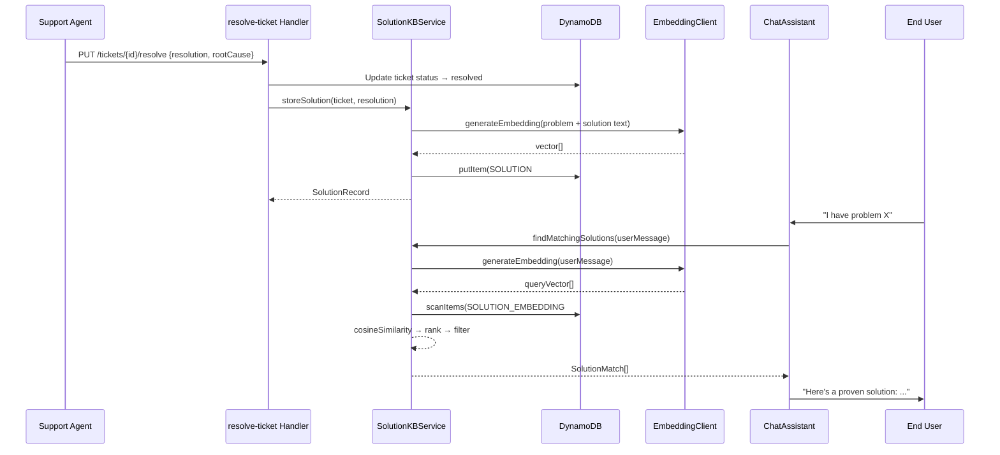

# Design Document: Solution Knowledge Base

## Overview

When support agents resolve a ticket, they record the solution. This feature captures those problem-solution pairs into a searchable knowledge base stored in DynamoDB with vector embeddings, enabling AI chat agents to automatically find and apply proven solutions to similar incoming issues.

## Main Algorithm/Workflow



## Core Interfaces/Types

```typescript
// --- New types in src/types/solution.ts ---

export interface SolutionRecord {
  PK: string;                    // "SOLUTION#<solutionId>"
  SK: string;                    // "METADATA"
  solutionId: string;
  ticketId: string;              // source ticket
  problem: string;               // ticket subject + description
  resolution: string;            // agent-provided solution text
  rootCause?: string;            // optional root cause
  category?: string;             // inherited from ticket
  tags: string[];                // inherited from ticket + auto-generated
  resolvedBy: string;            // agent who resolved
  successCount: number;          // times this solution was applied successfully
  failureCount: number;          // times this solution was reported unhelpful
  createdAt: string;             // ISO 8601
  updatedAt: string;
}

export interface SolutionEmbeddingRecord {
  PK: string;                    // "SOLUTION_EMBEDDING#<solutionId>"
  SK: string;                    // "VECTOR"
  solutionId: string;
  problemText: string;           // combined subject + description
  resolutionText: string;
  vector: number[];              // embedding of problem + resolution
  category?: string;
  createdAt: string;
}

export interface SolutionMatch {
  solutionId: string;
  ticketId: string;
  problem: string;
  resolution: string;
  similarityScore: number;
  successRate: number;           // successCount / (successCount + failureCount)
  category?: string;
}

export interface StoreSolutionInput {
  ticketId: string;
  subject: string;
  description: string;
  resolution: string;
  rootCause?: string;
  category?: string;
  tags?: string[];
  resolvedBy: string;
}

export interface FindSolutionsOptions {
  limit?: number;                // default: 5
  minSimilarity?: number;        // default: 0.7
}

export interface ResolveTicketRequest {
  resolution: string;
  rootCause?: string;
  resolvedBy: string;
}
```

## Key Functions with Formal Specifications

### Function 1: storeSolution()

```typescript
// In src/services/solution-knowledge-base.ts
async function storeSolution(input: StoreSolutionInput): Promise<SolutionRecord>
```

**Preconditions:**
- `input.ticketId` is non-empty string
- `input.subject` is non-empty string
- `input.description` is non-empty string
- `input.resolution` is non-empty string with length ≥ 10 characters
- `input.resolvedBy` is non-empty string

**Postconditions:**
- Returns a valid `SolutionRecord` with a generated `solutionId`
- A `SOLUTION#<solutionId>` item exists in DynamoDB with SK `METADATA`
- A `SOLUTION_EMBEDDING#<solutionId>` item exists in DynamoDB with SK `VECTOR`
- The embedding vector is generated from the combined problem + resolution text
- `successCount` and `failureCount` are initialized to 0
- `createdAt` and `updatedAt` are set to current timestamp

**Loop Invariants:** N/A

### Function 2: findMatchingSolutions()

```typescript
async function findMatchingSolutions(
  query: string,
  options?: FindSolutionsOptions
): Promise<SolutionMatch[]>
```

**Preconditions:**
- `query` is non-empty string (the user's problem description)
- `options.limit` if provided is a positive integer
- `options.minSimilarity` if provided is in range (0, 1]

**Postconditions:**
- Returns array of `SolutionMatch` sorted by: (1) successRate descending, then (2) similarityScore descending
- All returned matches have `similarityScore >= minSimilarity` (default 0.7)
- Array length ≤ `limit` (default 5)
- Each match includes the full resolution text for the chat agent to use
- Returns empty array if no solutions meet the threshold

**Loop Invariants:**
- During similarity scan: all previously scored solutions maintain their computed similarity values

### Function 3: recordSolutionFeedback()

```typescript
async function recordSolutionFeedback(
  solutionId: string,
  wasHelpful: boolean
): Promise<void>
```

**Preconditions:**
- `solutionId` is non-empty string referencing an existing solution
- `wasHelpful` is a boolean

**Postconditions:**
- If `wasHelpful === true`: `successCount` is incremented by 1
- If `wasHelpful === false`: `failureCount` is incremented by 1
- `updatedAt` is set to current timestamp
- No other fields are modified

**Loop Invariants:** N/A

### Function 4: getSolution()

```typescript
async function getSolution(solutionId: string): Promise<SolutionRecord | undefined>
```

**Preconditions:**
- `solutionId` is non-empty string

**Postconditions:**
- Returns the `SolutionRecord` if it exists, `undefined` otherwise
- No side effects

**Loop Invariants:** N/A

## Algorithmic Pseudocode

### Store Solution Algorithm

```typescript
async function storeSolution(input: StoreSolutionInput): Promise<SolutionRecord> {
  // Validate required fields
  if (!input.ticketId?.trim()) throw new Error('ticketId is required');
  if (!input.subject?.trim()) throw new Error('subject is required');
  if (!input.description?.trim()) throw new Error('description is required');
  if (!input.resolution?.trim() || input.resolution.trim().length < 10) {
    throw new Error('resolution must be at least 10 characters');
  }
  if (!input.resolvedBy?.trim()) throw new Error('resolvedBy is required');

  const solutionId = `SOL-${uuid()}`;
  const now = formatDate(new Date());

  // Combine problem + resolution for richer embedding
  const combinedText = `Problem: ${input.subject}\n${input.description}\n\nSolution: ${input.resolution}`;

  // Generate embedding vector
  const { embedding } = await generateEmbeddingWithFallback({ text: combinedText });

  // Store solution metadata
  const record: SolutionRecord = {
    PK: `SOLUTION#${solutionId}`,
    SK: 'METADATA',
    solutionId,
    ticketId: input.ticketId,
    problem: `${input.subject}\n${input.description}`,
    resolution: input.resolution.trim(),
    rootCause: input.rootCause?.trim(),
    category: input.category,
    tags: input.tags || [],
    resolvedBy: input.resolvedBy,
    successCount: 0,
    failureCount: 0,
    createdAt: now,
    updatedAt: now,
  };
  await putItem(record);

  // Store embedding for similarity search
  const embeddingRecord: SolutionEmbeddingRecord = {
    PK: `SOLUTION_EMBEDDING#${solutionId}`,
    SK: 'VECTOR',
    solutionId,
    problemText: `${input.subject}\n${input.description}`,
    resolutionText: input.resolution.trim(),
    vector: embedding,
    category: input.category,
    createdAt: now,
  };
  await putItem(embeddingRecord);

  return record;
}
```

### Find Matching Solutions Algorithm

```typescript
async function findMatchingSolutions(
  query: string,
  options: FindSolutionsOptions = {}
): Promise<SolutionMatch[]> {
  const { limit = 5, minSimilarity = 0.7 } = options;

  if (!query?.trim()) return [];

  // Step 1: Generate query embedding
  const { embedding: queryVector } = await generateEmbeddingWithFallback({ text: query.trim() });

  // Step 2: Scan all solution embeddings
  const embeddings = await scanItems(
    'begins_with(PK, :prefix) AND SK = :sk',
    { ':prefix': 'SOLUTION_EMBEDDING#', ':sk': 'VECTOR' }
  ) as SolutionEmbeddingRecord[];

  // Step 3: Compute similarity scores and filter
  const scored: Array<{ embedding: SolutionEmbeddingRecord; score: number }> = [];
  for (const emb of embeddings) {
    const score = cosineSimilarity(queryVector, emb.vector);
    if (score >= minSimilarity) {
      scored.push({ embedding: emb, score });
    }
  }

  // Step 4: Fetch solution metadata for scored results
  const matches: SolutionMatch[] = [];
  for (const { embedding: emb, score } of scored) {
    const solution = await getItem(`SOLUTION#${emb.solutionId}`, 'METADATA') as SolutionRecord | undefined;
    if (!solution) continue;

    const total = solution.successCount + solution.failureCount;
    const successRate = total > 0 ? solution.successCount / total : 0.5; // default 0.5 for unrated

    matches.push({
      solutionId: emb.solutionId,
      ticketId: solution.ticketId,
      problem: emb.problemText,
      resolution: emb.resolutionText,
      similarityScore: score,
      successRate,
      category: emb.category,
    });
  }

  // Step 5: Sort by success rate desc, then similarity desc
  matches.sort((a, b) => {
    if (b.successRate !== a.successRate) return b.successRate - a.successRate;
    return b.similarityScore - a.similarityScore;
  });

  // Step 6: Return top N
  return matches.slice(0, limit);
}
```

### Resolve Ticket Handler Integration

```typescript
// In src/handlers/resolve-ticket.ts
export async function handler(event: APIGatewayProxyEvent): Promise<APIGatewayProxyResult> {
  const ticketId = event.pathParameters?.ticketId;
  if (!ticketId) return errorResponse(400, 'ticketId is required');

  const body = JSON.parse(event.body || '{}') as ResolveTicketRequest;
  if (!body.resolution?.trim()) return errorResponse(400, 'resolution is required');
  if (!body.resolvedBy?.trim()) return errorResponse(400, 'resolvedBy is required');

  // Fetch existing ticket
  const existing = await getItem(`TICKET#${ticketId}`, 'METADATA');
  if (!existing) return errorResponse(404, 'Ticket not found');

  // Update ticket status to resolved + store resolution text
  const now = formatDate(new Date());
  await updateItem(`TICKET#${ticketId}`, 'METADATA',
    'SET #status = :status, resolvedAt = :resolvedAt, updatedAt = :updatedAt, resolution = :resolution, rootCause = :rootCause, GSI2PK = :gsi2pk',
    {
      ':status': 'resolved',
      ':resolvedAt': now,
      ':updatedAt': now,
      ':resolution': body.resolution.trim(),
      ':rootCause': body.rootCause?.trim() || null,
      ':gsi2pk': 'STATUS#resolved',
    },
    { '#status': 'status' }
  );

  // Store problem-solution pair in solution knowledge base
  await storeSolution({
    ticketId,
    subject: existing.subject as string,
    description: existing.description as string,
    resolution: body.resolution,
    rootCause: body.rootCause,
    category: existing.category as string | undefined,
    tags: existing.tags as string[] | undefined,
    resolvedBy: body.resolvedBy,
  });

  return successResponse({ ticketId, status: 'resolved', resolvedAt: now });
}
```

### Chat Assistant Integration

```typescript
// Modifications to processMessage() in src/handlers/chat-assistant.ts
async function processMessage(request: ChatRequest): Promise<ChatResponse> {
  // ... existing code: store user message, classify issue ...

  // NEW: Search solution knowledge base for proven solutions
  let solutionMatches: SolutionMatch[] = [];
  try {
    solutionMatches = await findMatchingSolutions(message, {
      limit: 3,
      minSimilarity: 0.7,
    });
  } catch (error) {
    logger.warn('Solution KB search failed, continuing without solutions', {
      error: error instanceof Error ? error.message : String(error),
    });
  }

  // ... existing code: search knowledge base articles, search similar tickets ...

  // Build prompt with solution context injected
  const solutionContext = solutionMatches
    .map((s, i) => `Solution ${i + 1} (${Math.round(s.similarityScore * 100)}% match, ${Math.round(s.successRate * 100)}% success rate):\nProblem: ${s.problem}\nResolution: ${s.resolution}`)
    .join('\n\n');

  const prompt = `You are NovaSupport AI...
${solutionContext ? `\nPROVEN SOLUTIONS FROM KNOWLEDGE BASE:\n${solutionContext}\n\nIMPORTANT: If any proven solution closely matches the user's issue, present that solution first. Mention it has been verified by the support team.` : ''}
...`;

  // ... existing code: invoke Nova, calculate confidence ...

  // Boost confidence when high-quality solutions are found
  let adjustedConfidence = confidence;
  if (solutionMatches.length > 0 && solutionMatches[0].similarityScore > 0.85) {
    adjustedConfidence = Math.min(1.0, confidence + 0.15);
  }

  // ... rest of existing response logic with adjustedConfidence ...
}
```

## Example Usage

```typescript
// Example 1: Agent resolves a ticket via API
// PUT /tickets/TKT-123/resolve
const resolveRequest = {
  resolution: "The user's VPN connection was failing due to an expired certificate. Renewed the SSL certificate in the admin panel under Settings > Security > Certificates and restarted the VPN service.",
  rootCause: "Expired SSL certificate for VPN gateway",
  resolvedBy: "agent@company.com"
};
// Response: { ticketId: "TKT-123", status: "resolved", resolvedAt: "2024-01-15T10:30:00Z" }

// Example 2: Solution is automatically stored and searchable
const solutions = await findMatchingSolutions("VPN not connecting, certificate error");
// Returns: [{ solutionId: "SOL-abc", resolution: "Renewed the SSL certificate...", similarityScore: 0.92, successRate: 0.5 }]

// Example 3: Chat agent auto-solves using the knowledge base
// User in chat: "My VPN keeps disconnecting with a cert error"
// Chat assistant finds the stored solution with 92% similarity
// Response: "This looks like an expired VPN certificate issue. Our team has resolved this before by renewing the SSL certificate. Let me check if that applies to your case..."

// Example 4: Feedback loop improves ranking
await recordSolutionFeedback("SOL-abc", true);  // user confirmed it helped
// Next time, SOL-abc ranks higher due to improved successRate

// Example 5: Get a specific solution
const solution = await getSolution("SOL-abc");
// Returns full SolutionRecord with metadata, counts, timestamps
```


## Correctness Properties

*A property is a characteristic or behavior that should hold true across all valid executions of a system-essentially, a formal statement about what the system should do. Properties serve as the bridge between human-readable specifications and machine-verifiable correctness guarantees.*

### Property 1: Store solution round trip

*For any* valid StoreSolutionInput, storing the solution and then calling getSolution with the returned solutionId SHALL produce a SolutionRecord whose ticketId, problem, resolution, resolvedBy, category, and tags match the original input, with solutionId prefixed by "SOL-", successCount and failureCount equal to 0, and createdAt and updatedAt set to valid ISO 8601 timestamps.

**Validates: Requirements 2.1, 2.3, 2.4, 5.1**

### Property 2: Invalid input rejection

*For any* StoreSolutionInput where at least one required field (ticketId, subject, description, resolution, resolvedBy) is empty, missing, or where the resolution is fewer than 10 characters, storeSolution SHALL reject the input with a validation error.

**Validates: Requirements 2.5, 2.6**

### Property 3: Similarity threshold filtering

*For any* set of stored solutions and any search query with a given minSimilarity threshold, all SolutionMatch results returned by findMatchingSolutions SHALL have a similarityScore greater than or equal to the threshold, and the total number of results SHALL not exceed the specified limit.

**Validates: Requirements 3.2, 3.4**

### Property 4: Search result ordering

*For any* array of SolutionMatch results returned by findMatchingSolutions, the results SHALL be sorted by Success_Rate descending first, then by similarityScore descending. Solutions with zero feedback SHALL use a default Success_Rate of 0.5.

**Validates: Requirements 3.3, 3.6**

### Property 5: Empty query returns empty results

*For any* string composed entirely of whitespace characters (including the empty string), findMatchingSolutions SHALL return an empty array.

**Validates: Requirement 3.7**

### Property 6: Feedback increments exactly one counter

*For any* existing SolutionRecord and any boolean wasHelpful value, recording feedback SHALL increment successCount by 1 if wasHelpful is true or failureCount by 1 if wasHelpful is false, update updatedAt, and leave all other fields (ticketId, problem, resolution, rootCause, category, tags, resolvedBy, createdAt, and the other counter) unchanged.

**Validates: Requirements 4.1, 4.2, 4.3, 4.4**

### Property 7: getSolution is side-effect free

*For any* stored SolutionRecord, calling getSolution twice in succession with the same solutionId SHALL return identical records, and the underlying data SHALL remain unchanged between calls.

**Validates: Requirements 5.1, 5.3**

### Property 8: Confidence boosting is bounded

*For any* base confidence value between 0 and 1 and any SolutionMatch with similarityScore above 0.85, the adjusted confidence SHALL equal min(1.0, baseConfidence + 0.15).

**Validates: Requirement 6.3**

### Property 9: Solution context in prompt

*For any* non-empty array of SolutionMatch results, the constructed prompt context string SHALL contain the resolution text, similarity score percentage, and Success_Rate percentage for each match.

**Validates: Requirement 6.2**
