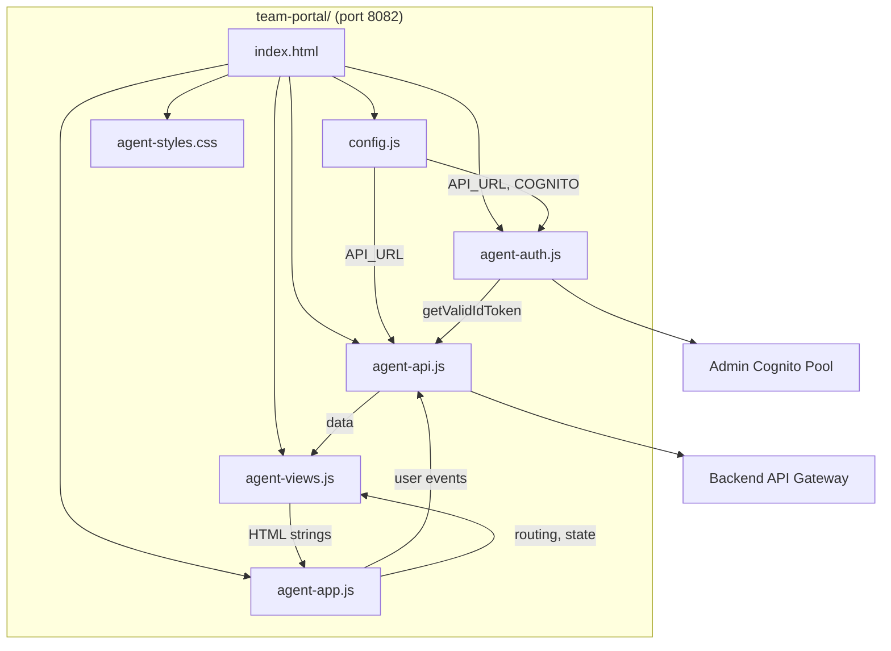

# Design Document

## Overview

The Team Member Portal is a static HTML/JS/CSS frontend that provides individual support agents with a focused workspace to manage their assigned tickets, communicate with users, and track personal performance. It reuses the admin Cognito user pool for authentication and the existing Backend API. The portal is served locally on port 8082 and uses hash-based routing, following the same architectural patterns as the existing user portal and admin dashboard.

Key design decisions:
- IIFE module pattern (matching existing portals) — no build tools or frameworks
- `agent_` prefix for localStorage keys to avoid conflicts with admin/user portals
- Admin Cognito pool (`us-east-1_Kl64pgBSV`) since team members are admin-level users
- Hash-based routing with 3 main views: Dashboard, Ticket Workspace, Profile
- Teal/cyan color scheme to visually distinguish from admin (blue) and user (purple) portals

## Architecture



### Script Loading Order
1. `config.js` — Configuration constants
2. `agent-auth.js` — Cognito authentication (depends on CONFIG)
3. `agent-api.js` — API client (depends on CONFIG, AgentAuth)
4. `agent-views.js` — View rendering functions (pure, no dependencies)
5. `agent-app.js` — Application controller (depends on all above)

### Routing Map
| Hash | View | Description |
|------|------|-------------|
| `#/` or empty | Dashboard | Agent's ticket queue + team tickets |
| `#/ticket/{id}` | Ticket Workspace | Ticket detail, messages, status updates |
| `#/profile` | Agent Profile | Team info, performance stats |

## Components and Interfaces

### 1. config.js
```javascript
const CONFIG = {
  API_URL: 'https://1htq8dkcn3.execute-api.us-east-1.amazonaws.com/dev',
  COGNITO: {
    REGION: 'us-east-1',
    USER_POOL_ID: 'us-east-1_Kl64pgBSV',
    CLIENT_ID: '13n0c7acq366joisvccgec5rk6',
  },
};
```

### 2. agent-auth.js — `AgentAuth` IIFE
Mirrors `PortalAuth` pattern with `agent_` localStorage prefix.

| Method | Signature | Description |
|--------|-----------|-------------|
| signIn | `(email, password) → Promise<tokens>` | Authenticate via USER_PASSWORD_AUTH, store tokens with agent_ prefix |
| signOut | `() → void` | Clear all agent_ tokens from localStorage |
| getIdToken | `() → string\|null` | Get stored agent_idToken |
| getValidIdToken | `() → Promise<string\|null>` | Get token, auto-refresh if expiring within 60s |
| getEmail | `() → string\|null` | Get stored agent_userEmail |
| isAuthenticated | `() → boolean` | Check if agent_idToken exists |
| refreshSession | `() → Promise<tokens>` | Refresh using agent_refreshToken |

localStorage keys: `agent_idToken`, `agent_accessToken`, `agent_refreshToken`, `agent_userEmail`

### 3. agent-api.js — `AgentAPI` IIFE
Authenticated fetch wrapper using AgentAuth tokens.

| Method | Signature | Description |
|--------|-----------|-------------|
| listTickets | `(params) → Promise<{tickets}>` | GET /tickets with query params (assignedTo, assignedTeam, status) |
| getTicket | `(ticketId) → Promise<ticket>` | GET /tickets/{ticketId} |
| updateTicketStatus | `(ticketId, status, resolution?, rootCause?) → Promise` | PUT /tickets/{ticketId}/status |
| claimTicket | `(ticketId, agentEmail) → Promise` | PUT /tickets/{ticketId}/status with assignedTo + status=in_progress |
| getMessages | `(ticketId) → Promise<{messages}>` | GET /tickets/{ticketId}/messages |
| addMessage | `(ticketId, {content, userId}) → Promise` | POST /tickets/{ticketId}/messages |
| listTeams | `() → Promise<{teams}>` | GET /teams |
| resolveTicket | `(ticketId, resolution, rootCause?) → Promise` | POST /tickets/{ticketId}/resolve |

Error handling: 401 → sign out + redirect, 400 → throw with details, 500+ → "Service temporarily unavailable", network error → "Unable to connect"

### 4. agent-views.js — `AgentViews` IIFE
Pure rendering functions that return HTML strings.

| Function | Description |
|----------|-------------|
| `esc(str)` | HTML-escape string |
| `statusColor(status)` | Return badge color class for status |
| `statusLabel(status)` | Return human-readable status label |
| `priorityName(priority)` | Return priority CSS class name |
| `priorityLabel(priority)` | Return priority display label |
| `formatDate(dateStr)` | Format ISO date to readable string |
| `renderDashboard(myTickets, teamTickets, stats)` | Render full dashboard with stats panel, personal queue, team queue |
| `renderTicketCard(ticket, isTeamTicket)` | Render a ticket card with optional Claim button |
| `renderTicketWorkspace(ticket, messages)` | Render ticket detail with message thread, status dropdown, resolve button |
| `renderResolutionForm()` | Render resolution summary + root cause form |
| `renderProfile(agent, team, stats)` | Render agent profile with team info and performance stats |
| `renderMessageThread(messages)` | Render chronological message list |
| `renderStatsPanel(stats)` | Render ticket count summary by status |

### 5. agent-app.js — `AgentApp` IIFE
Application controller handling routing, state, and event binding.

State:
- `myTickets[]` — tickets assigned to the agent
- `teamTickets[]` — unassigned tickets for the agent's team
- `agentTeam` — the agent's team object (resolved from teams list)
- `autoRefreshInterval` — 60-second refresh timer

| Function | Description |
|----------|-------------|
| `init()` | Check auth, bind UI, navigate to current hash |
| `navigate(hash)` | Route to appropriate view |
| `loadDashboard()` | Fetch agent's tickets + team tickets, compute stats, render |
| `loadTicketWorkspace(ticketId)` | Fetch ticket + messages, render workspace |
| `loadProfile()` | Fetch teams, find agent's team, compute performance stats, render |
| `claimTicket(ticketId)` | Call API to claim, refresh dashboard |
| `updateStatus(ticketId, newStatus)` | Call API to update status, refresh workspace |
| `sendMessage(ticketId, content)` | Call API to post message, refresh thread |
| `resolveTicket(ticketId, resolution, rootCause)` | Call API to resolve, refresh workspace |
| `computeStats(tickets)` | Compute counts by status + avg resolution time |
| `showToast(message, type)` | Display toast notification |

### 6. index.html
Single-page HTML with:
- Auth screen (sign-in form only — no registration, agents are admin users)
- Nav bar with Dashboard, Profile links + team name display + sign out
- Three view sections: dashboard, ticket workspace, profile
- Toast container
- Script tags in loading order

### 7. agent-styles.css
Teal/cyan color scheme (`#0d9488` primary, `#115e59` dark, `#ccfbf1` light) to distinguish from:
- Admin dashboard (blue theme)
- User portal (purple theme)

Responsive breakpoint at 768px for single-column mobile layout.

## Data Models

### Ticket (from Backend API)
```
{
  ticketId, userId, subject, description, status, priority,
  assignedTo, assignedTeam, category, tags[],
  resolution, rootCause, resolvedAt,
  createdAt, updatedAt
}
```

### Team (from GET /teams)
```
{
  teamId, teamName, description, expertise[], currentTicketCount
}
```

### Message (from GET /tickets/{id}/messages)
```
{
  messageId, ticketId, userId, content, createdAt
}
```

### Agent Stats (computed client-side)
```
{
  totalResolved: number,
  byStatus: { assigned: n, in_progress: n, pending_user: n, escalated: n, resolved: n },
  avgResolutionTimeMs: number
}
```

### Team Resolution Strategy
The agent's team is determined by:
1. Fetch all teams via GET /teams
2. Fetch agent's tickets via GET /tickets?assignedTo={email}
3. The `assignedTeam` field on the agent's tickets identifies their team
4. Match against teams list to get team details (description, expertise)
5. If no tickets or no team match → display "Unassigned"

## Correctness Properties

1. **Token Storage Isolation**: All localStorage keys used by AgentAuth MUST use the `agent_` prefix. No key may collide with admin (`idToken`, `accessToken`) or user portal (`portal_`) keys.

2. **Dashboard Sort Order**: My tickets on the dashboard MUST be sorted by priority descending, then by createdAt ascending (oldest first within same priority).

3. **Team Ticket Separation**: Team tickets section MUST only show tickets where `assignedTeam` matches the agent's team AND `assignedTo` is empty/null.

4. **Status Filter Correctness**: When a status filter is applied, every displayed ticket MUST have a status matching the filter value. When no filter is applied, all tickets are shown.

5. **Valid Status Transitions**: The status dropdown in the ticket workspace MUST only offer values from the set: {assigned, in_progress, pending_user, escalated, resolved}.

6. **Claim Sets AssignedTo**: When claiming a ticket, the API call MUST set `assignedTo` to the agent's email and `status` to "in_progress".

7. **Resolution Requires Summary**: The resolve action MUST NOT be submitted if the resolution summary field is empty.

8. **Stats Computation Accuracy**: The resolved ticket count MUST equal the number of tickets with status "resolved" where assignedTo matches the agent's email.

9. **Avg Resolution Time**: Average resolution time MUST be computed as the mean of (resolvedAt - createdAt) for all resolved tickets assigned to the agent. If no resolved tickets exist, display "N/A".

10. **Auth Redirect**: Any API call returning 401 MUST trigger sign-out and redirect to the sign-in form.

11. **Error Preservation**: When an API call fails during message send or status update, the user's input (message text, selected status) MUST be preserved in the form.

12. **Auto-Refresh Interval**: The dashboard MUST auto-refresh every 60 seconds while the dashboard view is active.

13. **Hash Routing Consistency**: Every navigation action MUST update location.hash, and every hashchange MUST render the correct view.

14. **XSS Prevention**: All user-provided content rendered in HTML MUST be escaped via the `esc()` function.

## Error Handling

| Error Type | HTTP Status | User-Facing Behavior |
|-----------|-------------|---------------------|
| Validation error | 400 | Toast with specific error details |
| Unauthorized | 401 | Sign out + redirect to sign-in with "Session expired" message |
| Not found | 404 | "Ticket not found" message |
| Conflict (claim race) | 409 | Toast "Ticket already claimed" + refresh team list |
| Server error | 500+ | Toast "Service temporarily unavailable" |
| Network error | — | Toast "Unable to connect to the server" |

Form data preservation: On any failed API call, message textarea content and form field values are NOT cleared.

Token refresh flow: Before each API call, `getValidIdToken()` checks JWT expiry. If token expires within 60 seconds, it refreshes automatically. If refresh fails, user is redirected to sign-in.

## Testing Strategy

Two test files using Jest:
1. `test/team-portal-views.test.ts` — Unit tests for AgentViews rendering functions
2. `test/team-portal-views.property.test.ts` — Property-based tests using fast-check for correctness properties (sorting, filtering, stats computation, XSS escaping)
