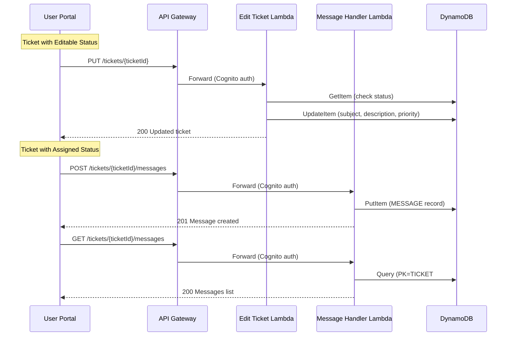

# Design Document: Ticket Edit & Messaging

## Overview

This feature extends the NovaSupport system with two capabilities based on ticket assignment status:

1. **Direct editing** for unassigned tickets (status "new" or "analyzing") — users can modify subject, description, and priority via a PUT endpoint.
2. **Messaging** for assigned tickets — users submit comments/change requests stored as separate DynamoDB items, visible in both the user portal and admin portal.

The design follows existing patterns: DynamoDB single-table design, Lambda handlers behind API Gateway with Cognito auth, and vanilla JS SPAs for both portals.

## Architecture



## Components and Interfaces

### 1. Edit Ticket Lambda (`src/handlers/edit-ticket.ts`)

Handles `PUT /tickets/{ticketId}`. Validates the request, checks that the ticket exists and has an editable status, then updates the ticket fields.

**Request body:**
```json
{
  "subject": "string",
  "description": "string",
  "priority": 1 | 5 | 8 | 10
}
```

**Responses:**
- `200` — Updated ticket fields returned
- `400` — Validation error (empty fields, invalid priority)
- `404` — Ticket not found
- `409` — Ticket is no longer editable (assigned status)

**Logic:**
1. Parse and validate request body (subject non-empty, description non-empty, priority in [1, 5, 8, 10])
2. Fetch ticket from DynamoDB by PK `TICKET#<ticketId>`, SK `METADATA`
3. Check ticket status is in `["new", "analyzing"]`; if not, return 409
4. Update subject, description, priority, updatedAt, and GSI2SK (priority-based sort key)
5. Return updated ticket data

### 2. Message Handler Lambda (`src/handlers/ticket-messages.ts`)

Handles both `POST /tickets/{ticketId}/messages` (create) and `GET /tickets/{ticketId}/messages` (list).

**POST request body:**
```json
{
  "content": "string",
  "userId": "string"
}
```

**POST response (201):**
```json
{
  "messageId": "MSG-<uuid>",
  "ticketId": "string",
  "userId": "string",
  "content": "string",
  "createdAt": "ISO 8601"
}
```

**GET response (200):**
```json
{
  "messages": [
    {
      "messageId": "string",
      "ticketId": "string",
      "userId": "string",
      "content": "string",
      "createdAt": "ISO 8601"
    }
  ]
}
```

**Logic (POST):**
1. Validate content is non-empty, userId is non-empty
2. Verify ticket exists (GetItem)
3. Generate messageId (`MSG-<uuid>`)
4. PutItem with PK `TICKET#<ticketId>`, SK `MESSAGE#<messageId>`
5. Return 201 with message data

**Logic (GET):**
1. Query DynamoDB with PK `TICKET#<ticketId>`, SK `begins_with("MESSAGE#")`
2. Sort results by createdAt ascending
3. Return messages array

### 3. User Portal Changes

**portal-api.js** — Add two new methods:
- `editTicket(ticketId, payload)` → `PUT /tickets/{ticketId}`
- `addMessage(ticketId, payload)` → `POST /tickets/{ticketId}/messages`
- `getMessages(ticketId)` → `GET /tickets/{ticketId}/messages`

**portal-views.js** — Add rendering functions:
- `renderEditableTicketDetail(ticket)` — Renders ticket detail with inline edit form for subject, description, priority
- `renderAssignedTicketDetail(ticket, messages)` — Renders ticket detail with read-only fields and a message input form plus message history
- `isEditableStatus(status)` — Returns true if status is "new" or "analyzing"
- `renderMessageList(messages)` — Renders a list of messages with content, sender, and timestamp

**portal-validation.js** — Add:
- `validateEditForm(subject, description, priority)` — Validates edit form fields
- `validateMessage(content)` — Validates message content is non-empty

**portal-app.js** — Wire up:
- On ticket detail load, check `isEditableStatus` to decide which view to render
- Bind edit form submission → call `PortalAPI.editTicket()`
- Bind message form submission → call `PortalAPI.addMessage()`
- Load messages on assigned ticket detail view

### 4. Admin Portal Changes

**frontend/api.js** — Add:
- `getTicketMessages(ticketId)` → `GET /tickets/{ticketId}/messages`

**frontend/app.js** — In `openTicketDetail()`:
- Fetch messages via `API.getTicketMessages(ticketId)`
- Add a "Messages" tab to the detail modal
- Render messages with content, sender email, and timestamp

### 5. CDK Stack Changes (`lib/novasupport-stack.ts`)

- Add `EditTicketFunction` Lambda pointing to `src/handlers/edit-ticket.handler`
- Add `TicketMessagesFunction` Lambda pointing to `src/handlers/ticket-messages.handler`
- Add `PUT /tickets/{ticketId}` route → EditTicketFunction
- Add `/tickets/{ticketId}/messages` resource with GET and POST methods → TicketMessagesFunction
- All routes use existing Cognito authorizer

## Data Models

### Message Record (DynamoDB)

```typescript
interface MessageRecord {
  PK: string;        // "TICKET#<ticketId>"
  SK: string;        // "MESSAGE#<messageId>"
  messageId: string;  // "MSG-<uuid>"
  ticketId: string;
  userId: string;     // email of the user who sent the message
  content: string;
  createdAt: string;  // ISO 8601
}
```

This follows the existing single-table pattern. Messages are stored under the same partition key as the ticket, enabling efficient queries with `begins_with("MESSAGE#")` on the sort key.

### Edit Ticket Request

The edit operation updates existing fields on the `TicketRecord`:
- `subject` (string, non-empty)
- `description` (string, non-empty)
- `priority` (1 | 5 | 8 | 10)
- `updatedAt` (auto-set to current ISO timestamp)
- `GSI2SK` (recalculated as `<priority>#<createdAt>` for sort ordering)

No new DynamoDB record type is needed for edits — the existing METADATA record is updated in place.


## Correctness Properties

*A property is a characteristic or behavior that should hold true across all valid executions of a system — essentially, a formal statement about what the system should do. Properties serve as the bridge between human-readable specifications and machine-verifiable correctness guarantees.*

### Property 1: Editable status renders edit form

*For any* ticket with status "new" or "analyzing", the rendered ticket detail HTML should contain edit form elements (input fields for subject and description, a select for priority, and a submit button).

**Validates: Requirements 1.1**

### Property 2: Assigned status renders message form without edit controls

*For any* ticket with status in ["assigned", "in_progress", "pending_user", "escalated", "resolved", "closed"], the rendered ticket detail HTML should contain a message input form and should NOT contain edit form input fields for subject, description, or priority.

**Validates: Requirements 1.2, 1.3**

### Property 3: Successful edit returns updated fields

*For any* valid edit payload (non-empty subject, non-empty description, priority in [1, 5, 8, 10]) applied to a ticket with an editable status, the Edit_Ticket_Handler should return status 200 with the updated subject, description, priority, and a recent updatedAt timestamp.

**Validates: Requirements 2.1, 2.5**

### Property 4: Edit rejected for assigned tickets

*For any* ticket with an assigned status and any edit payload, the Edit_Ticket_Handler should return status 409 Conflict.

**Validates: Requirements 2.2**

### Property 5: Invalid edit inputs rejected

*For any* edit payload where the subject is empty/whitespace, the description is empty/whitespace, or the priority is not in [1, 5, 8, 10], the Edit_Ticket_Handler should return status 400 with validation error details.

**Validates: Requirements 2.3, 2.4**

### Property 6: Message creation returns complete record

*For any* valid message content (non-empty string) and valid userId, the Message_Handler POST should return status 201 with a record containing messageId (matching `MSG-` prefix), ticketId, userId, content, and a createdAt timestamp.

**Validates: Requirements 3.1, 3.3**

### Property 7: Empty message rejected

*For any* string composed entirely of whitespace (including empty string), the Message_Handler POST should return status 400 with a validation error.

**Validates: Requirements 3.2**

### Property 8: Messages returned in ascending chronological order

*For any* set of messages on a ticket, the Message_Handler GET should return them sorted by createdAt in ascending order (oldest first).

**Validates: Requirements 3.4**

### Property 9: Admin message rendering includes required fields

*For any* non-empty array of messages, the admin portal message rendering function should produce HTML that contains the content, sender (userId), and timestamp for each message in the array.

**Validates: Requirements 4.1, 4.2**

### Property 10: Client-side edit validation rejects empty fields

*For any* edit form input where the subject is whitespace-only or the description is whitespace-only, the client-side validation function should return invalid with appropriate error messages.

**Validates: Requirements 5.1, 5.2**

### Property 11: Client-side message validation rejects empty content

*For any* string composed entirely of whitespace, the client-side message validation function should return invalid.

**Validates: Requirements 5.3**

## Error Handling

| Scenario | HTTP Status | Error Code | Message |
|---|---|---|---|
| Missing request body | 400 | MISSING_BODY | Request body is required |
| Invalid JSON | 400 | INVALID_JSON | Request body must be valid JSON |
| Empty subject/description | 400 | VALIDATION_ERROR | Validation error with field details |
| Invalid priority | 400 | VALIDATION_ERROR | Priority must be one of: 1, 5, 8, 10 |
| Ticket not found | 404 | TICKET_NOT_FOUND | Ticket {ticketId} not found |
| Ticket not editable | 409 | TICKET_NOT_EDITABLE | Ticket has been assigned and can no longer be edited directly. Send a message instead. |
| Empty message content | 400 | VALIDATION_ERROR | Message content is required |
| Internal server error | 500 | INTERNAL_ERROR | An error occurred (retryable: true) |

All error responses follow the existing pattern:
```json
{
  "error": {
    "code": "ERROR_CODE",
    "message": "Human-readable message",
    "details": ["optional array of specific issues"],
    "retryable": false
  }
}
```

## Testing Strategy

### Property-Based Testing

Library: **fast-check** (already used in the project)

Each correctness property above will be implemented as a property-based test with a minimum of 100 iterations. Tests will be tagged with comments referencing the design property:

```
// Feature: ticket-edit-messaging, Property N: <property title>
```

Property tests focus on:
- Edit handler status-based gating (Properties 3, 4, 5)
- Message handler creation and retrieval (Properties 6, 7, 8)
- View rendering based on ticket status (Properties 1, 2, 9)
- Client-side validation (Properties 10, 11)

### Unit Testing

Unit tests complement property tests for:
- Specific edge cases (empty messages array rendering, ticket not found)
- Integration points (DynamoDB mock interactions)
- Error response format verification
- Admin portal empty-state rendering (Requirement 4.3)

### Test Files

- `test/edit-ticket.test.ts` — Unit tests for edit ticket handler
- `test/edit-ticket.property.test.ts` — Property tests for edit handler (Properties 3, 4, 5)
- `test/ticket-messages.test.ts` — Unit tests for message handler
- `test/ticket-messages.property.test.ts` — Property tests for message handler (Properties 6, 7, 8)
- `test/portal-edit-messaging-views.test.ts` — Unit tests for portal view rendering
- `test/portal-edit-messaging-views.property.test.ts` — Property tests for view rendering (Properties 1, 2, 9)
- `test/portal-edit-messaging-validation.test.ts` — Unit tests for client-side validation
- `test/portal-edit-messaging-validation.property.test.ts` — Property tests for validation (Properties 10, 11)
