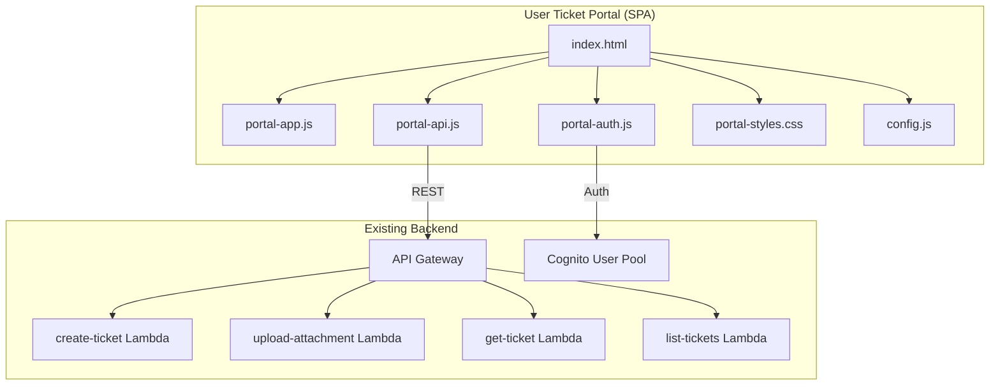

# Design Document: User Ticket Portal

## Overview

The User Ticket Portal is a standalone, customer-facing single-page application (SPA) that lives in a separate `user-portal/` directory alongside the existing `frontend/` admin dashboard. It provides authenticated end users with the ability to submit support tickets (with file attachments), view their ticket history, and inspect ticket details. The portal reuses the existing NovaSupport backend APIs (API Gateway + Lambda) and Cognito user pool for authentication, and adopts the same dark-themed design system as the admin dashboard.

The portal is built with vanilla HTML, CSS, and JavaScript (no framework) to match the existing frontend approach, keeping the stack simple and consistent.

## Architecture



The portal follows a client-side routing pattern using hash-based navigation (`#/tickets`, `#/new`, `#/tickets/:id`) to support browser back/forward without server-side routing. All state is managed in-memory within the app module, with session tokens persisted in `localStorage`.

## Components and Interfaces

### 1. Authentication Module (`portal-auth.js`)

Handles Cognito authentication flows. Mirrors the existing `auth.js` but scoped to the user portal context.

```typescript
interface AuthModule {
  signIn(email: string, password: string): Promise<CognitoTokens>;
  signUp(email: string, password: string): Promise<void>;
  confirmSignUp(email: string, code: string): Promise<void>;
  signOut(): void;
  getIdToken(): string | null;
  getEmail(): string | null;
  isAuthenticated(): boolean;
}

interface CognitoTokens {
  IdToken: string;
  AccessToken: string;
  RefreshToken: string;
}
```

### 2. API Client Module (`portal-api.js`)

Thin wrapper over `fetch` that attaches the Cognito JWT token to all requests. Exposes only the endpoints relevant to end users.

```typescript
interface PortalAPI {
  createTicket(payload: CreateTicketPayload): Promise<CreateTicketResponse>;
  listMyTickets(userId: string, status?: string): Promise<ListTicketsResponse>;
  getTicket(ticketId: string): Promise<TicketDetail>;
  requestUploadUrl(ticketId: string, fileName: string, fileType: string, fileSize: number): Promise<UploadUrlResponse>;
}

interface CreateTicketPayload {
  userId: string;
  subject: string;
  description: string;
  priority?: number; // 1=Low, 5=Medium, 8=High, 10=Critical
}

interface CreateTicketResponse {
  ticketId: string;
  status: string;
  priority: number;
  createdAt: string;
  message: string;
}

interface TicketDetail {
  ticketId: string;
  userId: string;
  subject: string;
  description: string;
  status: string;
  priority: number;
  assignedTo?: string;
  assignedTeam?: string;
  createdAt: string;
  updatedAt: string;
  resolvedAt?: string;
  tags: string[];
  category?: string;
  attachmentIds: string[];
}

interface ListTicketsResponse {
  tickets: TicketDetail[];
}

interface UploadUrlResponse {
  attachmentId: string;
  uploadUrl: string;
  s3Key: string;
  expiresIn: number;
}
```

### 3. Application Module (`portal-app.js`)

Manages routing, view rendering, and user interactions.

```typescript
interface PortalApp {
  init(): void;
  navigate(hash: string): void;
  renderTicketList(tickets: TicketDetail[]): void;
  renderTicketDetail(ticket: TicketDetail): void;
  renderSubmissionForm(): void;
  renderAuthScreen(): void;
  showToast(message: string, type: 'success' | 'error' | 'info'): void;
}
```

**Router**: Hash-based routing with the following routes:
| Hash | View | Description |
|------|------|-------------|
| `#/` | Ticket List | Default view showing user's tickets |
| `#/new` | Submission Form | Create a new ticket |
| `#/tickets/:id` | Ticket Detail | View a specific ticket |

### 4. File Upload Handler

Manages the drag-and-drop zone, file validation, and presigned URL upload flow.

```typescript
interface FileUploadHandler {
  initDropZone(dropZoneEl: HTMLElement, fileInputEl: HTMLInputElement): void;
  addFile(file: File): ValidationResult;
  removeFile(index: number): void;
  getFiles(): SelectedFile[];
  uploadAll(ticketId: string): Promise<UploadResult[]>;
  reset(): void;
}

interface SelectedFile {
  file: File;
  id: string;
}

interface ValidationResult {
  valid: boolean;
  error?: string;
}

interface UploadResult {
  fileName: string;
  success: boolean;
  attachmentId?: string;
  error?: string;
}

// Validation constants (matching backend)
const ALLOWED_TYPES: Record<string, { types: string[]; maxSize: number }> = {
  image: { types: ['image/png', 'image/jpeg', 'image/gif'], maxSize: 5 * 1024 * 1024 },
  document: { types: ['application/pdf', 'text/plain', 'text/log', 'application/x-log'], maxSize: 10 * 1024 * 1024 },
  video: { types: ['video/mp4', 'video/webm'], maxSize: 50 * 1024 * 1024 },
  audio: { types: ['audio/mpeg', 'audio/wav', 'audio/webm', 'audio/ogg'], maxSize: 5 * 1024 * 1024 },
};
```

### 5. Form Validator

Client-side validation for the submission form.

```typescript
interface FormValidator {
  validateSubject(value: string): ValidationResult;
  validateDescription(value: string): ValidationResult;
  validateForm(subject: string, description: string): FormValidationResult;
}

interface FormValidationResult {
  valid: boolean;
  errors: Record<string, string>;
}
```

## Data Models

### Client-Side State

```typescript
interface PortalState {
  user: {
    email: string;
    authenticated: boolean;
  } | null;
  tickets: TicketDetail[];
  currentTicket: TicketDetail | null;
  pendingFiles: SelectedFile[];
  loading: boolean;
  error: string | null;
}
```

### Status Display Mapping

```typescript
const STATUS_CONFIG: Record<string, { label: string; color: string }> = {
  new:          { label: 'New',          color: 'var(--blue)' },
  analyzing:    { label: 'Analyzing',    color: 'var(--teal)' },
  assigned:     { label: 'Assigned',     color: 'var(--purple)' },
  in_progress:  { label: 'In Progress',  color: 'var(--orange)' },
  pending_user: { label: 'Pending You',  color: 'var(--yellow)' },
  escalated:    { label: 'Escalated',    color: 'var(--red)' },
  resolved:     { label: 'Resolved',     color: 'var(--green)' },
  closed:       { label: 'Closed',       color: 'var(--text2)' },
};
```

### Priority Display Mapping

```typescript
const PRIORITY_CONFIG: Record<number, { label: string; color: string }> = {
  1:  { label: 'Low',      color: 'var(--green)' },
  5:  { label: 'Medium',   color: 'var(--yellow)' },
  8:  { label: 'High',     color: 'var(--orange)' },
  10: { label: 'Critical', color: 'var(--red)' },
};
```

### File Validation Rules (Client-Side, Matching Backend)

| Category | Allowed MIME Types | Max Size |
|----------|-------------------|----------|
| Image | image/png, image/jpeg, image/gif | 5 MB |
| Document | application/pdf, text/plain, text/log, application/x-log | 10 MB |
| Video | video/mp4, video/webm | 50 MB |
| Audio | audio/mpeg, audio/wav, audio/webm, audio/ogg | 5 MB |


## Correctness Properties

*A property is a characteristic or behavior that should hold true across all valid executions of a system — essentially, a formal statement about what the system should do. Properties serve as the bridge between human-readable specifications and machine-verifiable correctness guarantees.*

The following properties were derived from the acceptance criteria prework analysis. After reflection, redundant properties (2.3/7.3 testing form validation, and 5.1/5.2 testing detail view completeness) were consolidated.

### Property 1: Form validation rejects whitespace-only inputs

*For any* string composed entirely of whitespace characters (including empty string), submitting it as the subject or description in the Submission_Form should be rejected, and the form should report a validation error for the corresponding field.

**Validates: Requirements 2.3, 7.3**

### Property 2: File type validation rejects unsupported types

*For any* MIME type string that is not in the set of allowed types (image/png, image/jpeg, image/gif, application/pdf, text/plain, text/log, application/x-log, video/mp4, video/webm, audio/mpeg, audio/wav, audio/webm, audio/ogg), the file validation function should return an invalid result with an error message.

**Validates: Requirements 3.3**

### Property 3: File size validation rejects oversized files

*For any* allowed file type and any file size exceeding the maximum for that type's category, the file validation function should return an invalid result with an error message indicating the size limit.

**Validates: Requirements 3.4**

### Property 4: Ticket list is sorted by creation date descending

*For any* list of tickets returned from the API, after the portal sorts them for display, each ticket's creation date should be greater than or equal to the creation date of the next ticket in the list.

**Validates: Requirements 4.1**

### Property 5: Ticket list items contain required information

*For any* ticket object, the rendered list item HTML should contain the ticket's subject, a status badge, the priority label, and the creation date.

**Validates: Requirements 4.2**

### Property 6: Status filter shows only matching tickets

*For any* list of tickets and any selected status value, filtering the list by that status should produce a result where every ticket has the selected status, and no tickets with that status from the original list are missing.

**Validates: Requirements 4.5**

### Property 7: Ticket detail view displays all required fields

*For any* ticket object (with or without attachments), the rendered detail view should contain the subject, description, status, priority, creation date, updated date, and tags. If the ticket has attachment IDs, the view should also display the attachment information.

**Validates: Requirements 5.1, 5.2**

### Property 8: Status badge maps each status to a distinct color

*For any* two distinct valid status values, the Status_Badge color mapping should produce different colors. *For any* valid status value, the mapping should produce a non-empty color string.

**Validates: Requirements 5.3**

### Property 9: Route navigation updates URL hash

*For any* valid route string in the set of defined routes, calling the navigate function with that route should result in `window.location.hash` matching the route.

**Validates: Requirements 6.3**

### Property 10: API validation errors are displayed to user

*For any* API error response containing a details array, the rendered error output should include each detail string from the response.

**Validates: Requirements 7.1**

## Error Handling

### Client-Side Validation Errors
- Empty or whitespace-only subject/description: inline error message below the field, field border highlighted in red
- Unsupported file type: toast notification with allowed types listed, file not added to pending list
- Oversized file: toast notification with max size for the file category, file not added to pending list

### API Errors
- **400 (Validation Error)**: Display the specific `details` array from the error response as a list
- **404 (Not Found)**: Display "Ticket not found" message with a link back to the ticket list
- **500 (Server Error)**: Display "Service temporarily unavailable. Please try again later."
- **Network Error (fetch failure)**: Display "Unable to connect to the server. Check your internet connection."

### Authentication Errors
- **Invalid credentials**: Display Cognito error message (e.g., "Incorrect username or password")
- **Expired token**: Clear tokens from localStorage, redirect to sign-in form, show "Session expired" toast
- **Registration errors**: Display specific Cognito error (e.g., password policy violations)

### Attachment Upload Errors
- Individual attachment failures do not block the ticket creation — the ticket is created first, then attachments are uploaded sequentially
- Failed uploads show an error badge on the file item with a retry button
- Successful uploads show a green checkmark

## Testing Strategy

### Testing Framework
- **Unit tests**: Jest (already configured in the project)
- **Property-based tests**: fast-check (already a dependency in the project)

### Unit Tests
Unit tests cover specific examples, edge cases, and integration points:
- Auth flow: sign-in stores tokens, sign-out clears tokens, expired token redirects
- Form submission: valid input creates ticket, empty fields show errors
- File upload: drag-and-drop adds files, remove button removes files, upload sequence works
- Routing: hash changes render correct views, invalid routes show fallback
- API error handling: various HTTP error codes display correct messages

### Property-Based Tests
Property tests verify universal correctness properties across randomized inputs. Each property test:
- Runs a minimum of 100 iterations
- References its design document property number
- Uses the tag format: **Feature: user-ticket-portal, Property N: [title]**

Each correctness property (1–10) is implemented as a single property-based test:

1. **Property 1**: Generate random whitespace strings → validate they are rejected by form validator
2. **Property 2**: Generate random non-allowed MIME type strings → validate they are rejected by file validator
3. **Property 3**: Generate allowed file types with sizes exceeding limits → validate rejection
4. **Property 4**: Generate random lists of ticket objects with random dates → validate sort order
5. **Property 5**: Generate random ticket objects → validate rendered HTML contains required fields
6. **Property 6**: Generate random ticket lists and random status values → validate filter correctness
7. **Property 7**: Generate random ticket objects (with/without attachments) → validate detail view completeness
8. **Property 8**: Enumerate all status pairs → validate distinct colors (exhaustive, not random)
9. **Property 9**: Enumerate all valid routes → validate hash update (exhaustive, not random)
10. **Property 10**: Generate random error response objects with details arrays → validate all details appear in rendered output
