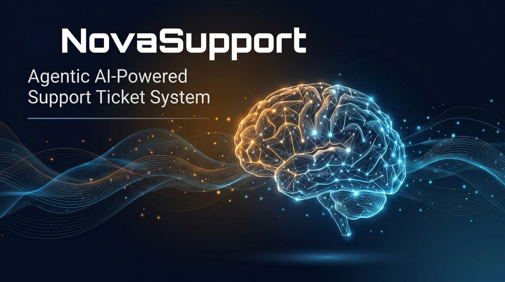

# 🚀 NovaSupport — Agentic AI Support Ticket System

An intelligent, fully serverless support ticket system built on AWS that leverages **Amazon Nova** AI models to automate ticket routing, analysis, response generation, and escalation — with minimal human intervention.




## 🌐 Live Demo Access

You can explore **NovaSupport** using the live portals below:


## 🔑 Demo Credentials

Use the following credentials to test different roles in the system:

| Role  | Portal URL | Email | Password |
|------|------------|-------|----------|
| **Admin** | http://novasupport-admin.s3-website-us-east-1.amazonaws.com | siddadeepika@gmail.com | Admin@1235 |
| **Team (Agent)** | http://novasupport-team.s3-website-us-east-1.amazonaws.com | deepikasid2111@gmail.com | Agent@1234 |
| **User** | http://novasupport-user.s3-website-us-east-1.amazonaws.com | thedev3333@gmail.com | User@1234 |

---
## 🧪 How to Use

1. Open the **User Portal**  
2. Log in using the **User credentials**  
3. Create a support ticket  
4. Log in as **Admin or Team**  
5. Observe:
   - AI-based ticket routing  
   - Priority classification  
   - Suggested responses  
   - Automated workflow  

---

## Table of Contents

- [Overview](#overview)
- [Key Features — How It Works](#key-features--how-it-works-simple-explanation)
- [Architecture](#architecture)
- [AWS Services Used](#aws-services-used)
- [Prerequisites](#prerequisites)
- [Installation](#installation)
- [Build & Deploy](#build--deploy)
- [Running the Frontends](#running-the-frontends)
- [AI Agents](#ai-agents)
- [Services](#services)
- [Monitoring & Observability](#monitoring--observability)

---

## Overview

NovaSupport is a three-portal support system:

| Portal | Description |
|--------|-------------|
| **Admin Portal** | Full dashboard for admins — manage tickets, teams, analytics, SLA, canned responses | 
| **User Portal** | End-user facing — submit tickets, track status, chat with AI assistant, rate resolutions | 
| **Team Portal** | For support agents — view assigned tickets, reply, resolve, translate messages |

All three portals share a single REST API backend deployed on AWS Lambda + API Gateway, with DynamoDB as the data store.

---

## Key Features — How It Works (Simple Explanation)

### 🤖 Smart Ticket Routing & Assignment
When a customer submits a support ticket, the AI (Amazon Nova) reads the ticket and automatically figures out which team should handle it — billing, authentication, general support, etc. Then it assigns the ticket to a specific team member using round-robin, so the workload is shared fairly across the team.

### 🚨 Automatic Escalation
If a ticket mentions sensitive topics like security breaches, legal issues, or compliance problems — or if the AI isn't confident enough in its analysis — the system automatically flags it for human review instead of trying to handle it on its own.

### 💬 AI Chat Assistant
End users can chat directly with an AI assistant to get quick answers without waiting for a human agent. The assistant uses the knowledge base and past ticket data to provide helpful responses.

### 🧠 AI-Powered Analysis
The AI can analyze not just text, but also images, documents, and videos attached to tickets. It uses Amazon Nova's multimodal capabilities to understand what's in the attachments and include that in the ticket analysis. It also suggests AI-generated responses that agents can use or customize.

### 🔍 Similar Ticket Search
When a new ticket comes in, the system uses semantic search (Nova Embeddings) to find similar past tickets. This helps agents see how similar issues were resolved before, speeding up resolution time.

### 🌐 Multi-Language Translation
Tickets and messages can be translated into any language with one click. The system auto-detects the source language using Amazon Comprehend and translates using Amazon Translate. Translation is available on replies, messages, and resolution summaries.

### 🎤 Voice Support
Users can use voice input — the system transcribes speech to text (Amazon Transcribe) and can also read responses aloud using text-to-speech (Amazon Polly).

### 📧 Email Notifications
When a ticket is resolved, the system can send a styled resolution email to the customer via Amazon SES, so they know their issue has been addressed.

### 📊 Analytics & SLA Tracking
Admins get a dashboard showing ticket trends, response times, and SLA compliance. The system tracks how fast tickets are being responded to and resolved, and raises alarms if SLAs are at risk.

### 📋 Ticket Management
Full lifecycle management — create, edit, delete, merge duplicate tickets, track activity logs, manage status (open → in-progress → escalated → resolved), and let customers rate their experience after resolution.

### 🔔 Real-Time Notifications
WebSocket-based real-time notifications keep agents and users updated instantly when ticket status changes or new messages arrive.

### ⏰ Automated Follow-Ups
The system automatically checks for tickets that need follow-up every 15 minutes and schedules reminders, so nothing falls through the cracks.

### 📚 Knowledge Base
A searchable knowledge base stores proven solutions. The AI uses this to suggest solutions for new tickets, and agents can add new articles as they resolve issues.

---

## Architecture

```
┌─────────────────┐  ┌─────────────────┐  ┌─────────────────┐
│  Admin Portal   │  │  User Portal    │  │  Team Portal    │
│                    │  │
└────────┬────────┘  └────────┬────────┘  └────────┬────────┘
         │                    │                    │
         └────────────────────┼────────────────────┘
                              │
                    ┌─────────▼─────────┐
                    │   API Gateway     │◄──── Cognito Authorizer
                    │   (REST + WS)     │      (2 User Pools)
                    └─────────┬─────────┘
                              │
              ┌───────────────┼───────────────┐
              │               │               │
     ┌────────▼──────┐ ┌─────▼─────┐ ┌───────▼───────┐
     │  Lambda Fns   │ │  SQS      │ │  EventBridge  │
     │  (30+ fns)    │ │  Queues   │ │  (Scheduled)  │
     └───────┬───────┘ └─────┬─────┘ └───────────────┘
             │               │
    ┌────────┼────────┬──────┼──────┬───────────┐
    │        │        │      │      │           │
┌───▼──┐ ┌──▼───┐ ┌──▼──┐ ┌▼────┐ ┌▼────────┐ ┌▼──────────┐
│Dynamo│ │  S3  │ │Nova │ │SES  │ │Translate│ │Polly/     │
│  DB  │ │      │ │(AI) │ │     │ │Comprehnd│ │Transcribe │
└──────┘ └──────┘ └─────┘ └─────┘ └─────────┘ └───────────┘
```

---

## AWS Services Used

| Service | Purpose |
|---------|---------|
| **Amazon DynamoDB** | Single-table design for tickets, teams, messages, activities, knowledge base |
| **Amazon S3** | Attachment storage with presigned URLs, 90-day lifecycle |
| **AWS Lambda** | 30+ serverless functions (Node.js 20.x) |
| **Amazon API Gateway** | REST API (with Cognito auth) + WebSocket API |
| **Amazon SQS** | Async ticket processing queue + multimodal processing queue (with DLQs) |
| **Amazon Cognito** | Two user pools — Admin/Agent pool and Portal (end-user) pool |
| **Amazon Bedrock (Nova)** | Nova Lite for AI reasoning, Nova Embeddings for semantic search |
| **Amazon Translate** | Multi-language ticket/message translation |
| **Amazon Comprehend** | Auto-detect source language |
| **Amazon Polly** | Text-to-speech for voice responses |
| **Amazon Transcribe** | Voice-to-text transcription |
| **Amazon SES** | Resolution email notifications |
| **Amazon CloudWatch** | Dashboard, alarms, logs, X-Ray tracing |
| **Amazon EventBridge** | Scheduled follow-up processing (every 15 min) |
| **AWS CDK** | Infrastructure as Code (TypeScript) |

---


## Prerequisites

- **Node.js** 20.x or later
- **AWS CLI** configured with credentials (`aws configure`)
- **AWS CDK CLI** (`npm install -g aws-cdk`)
- **AWS Account** with access to Bedrock (Amazon Nova models enabled in us-east-1)

---

## Installation

```bash
npm install
```

---

## Build & Deploy

```bash
# Compile TypeScript
npx tsc

# Deploy infrastructure to AWS (first time may take ~5 min)
npx cdk deploy --require-approval never
```

If this is your first CDK deployment in the account/region:

```bash
npx cdk bootstrap
```

After deployment, CDK outputs the API Gateway URL, Cognito User Pool IDs, WebSocket endpoint, and other resource identifiers. Update the `config.js` in each portal with these values.

---

## Running the Frontends

The three portals are static HTML/JS/CSS apps. Serve them locally with any static file server:

```bash
# Admin Portal
npx http-server frontend -p 3000

# User Portal
npx http-server user-portal -p 3001

# Team Member Portal
npx http-server team-portal -p 3002
```

Then open in your browser:
- Admin: `http://localhost:3000`
- User: `http://localhost:3001`
- Team: `http://localhost:3002`

---


## AI Agents

| Agent | File | Purpose |
|-------|------|---------|
| **Routing Agent** | `src/agents/routing-agent.ts` | Analyzes ticket content with Nova and assigns to the correct team (e.g., billing, auth, general) |
| **Assignment Agent** | `src/agents/assignment-agent.ts` | Round-robin assignment of tickets to eligible team members |
| **Escalation Agent** | `src/agents/escalation-agent.ts` | Flags tickets for human review based on: security/legal/compliance keywords, low AI confidence (<0.7), max retry attempts, complex multi-issue tickets |
| **Response Agent** | `src/agents/response-agent.ts` | Generates contextual AI response suggestions using ticket history and knowledge base |

---

## Services

| Service | File | Purpose |
|---------|------|---------|
| Analytics Engine | `analytics-engine.ts` | Metrics aggregation, trend detection, alerts |
| Auto Tagger | `auto-tagger.ts` | Automatically tags tickets based on content |
| Document Analyzer | `document-analyzer.ts` | Analyzes document attachments via Nova |
| Image Analyzer | `image-analyzer.ts` | Analyzes image attachments via Nova multimodal |
| Video Analyzer | `video-analyzer.ts` | Analyzes video attachments |
| Follow-up Scheduler | `follow-up-scheduler.ts` | Schedules and processes follow-up messages |
| Knowledge Base | `knowledge-base.ts` | CRUD + semantic search for support articles |
| Notification Service | `notification-service.ts` | Push notifications via WebSocket |
| Semantic Search | `semantic-search.ts` | Embedding-based vector search using Nova Embeddings |
| Similar Ticket Search | `similar-ticket-search.ts` | Finds related tickets by semantic similarity |
| SLA Tracker | `sla-tracker.ts` | Monitors response/resolution SLA compliance |
| Solution Knowledge Base | `solution-knowledge-base.ts` | Stores and retrieves proven solutions |
| Ticket Prioritization | `ticket-prioritization.ts` | Scores ticket priority based on content analysis |
| Translation Service | `translation-service.ts` | Wraps Amazon Translate with auto language detection |
| Voice Processor | `voice-processor.ts` | Handles voice transcription and TTS |
| Workflow Orchestrator | `workflow-orchestrator.ts` | End-to-end ticket processing pipeline |

---


## Monitoring & Observability

- **CloudWatch Dashboard**: `NovaSupport-Metrics` — API request volume, latency, errors, queue depth, DynamoDB capacity
- **Alarms**: High 5xx error rate, high API latency, DLQ messages, Lambda errors
- **X-Ray Tracing**: Enabled on API Gateway and key Lambda functions
- **Logs**: All Lambda functions log to `/aws/novasupport` CloudWatch log group

---

